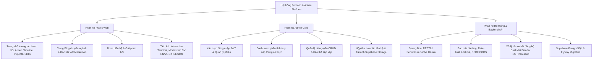
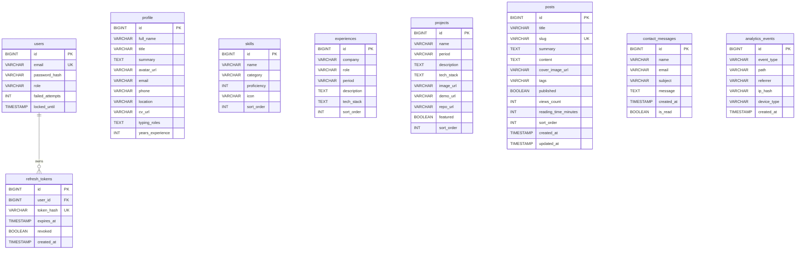

# TÀI LIỆU ĐẶC TẢ YÊU CẦU PHẦN MỀM (SRS)
## SOFTWARE REQUIREMENTS SPECIFICATION
### HỆ THỐNG PORTFOLIO CÁ NHÂN & NỀN TẢNG QUẢN TRỊ NỘI DUNG (HEADLESS CMS)

---

**Thông tin tài liệu:**
- **Dự án:** Personal Portfolio & Admin Management Platform
- **Chủ sở hữu & Kỹ sư phát triển:** Trần Vũ Thiện (Software Development Engineer)
- **Tiêu chuẩn áp dụng:** ISO/IEC/IEEE 29148:2018 (kế thừa cấu trúc IEEE 830-1998)
- **Phiên bản:** 1.0.0
- **Ngày phát hành:** 28/09/2026
- **Trạng thái:** Chính thức (Approved & Baseline)

---

## MỤC LỤC
1. [Giới thiệu tổng quan (Introduction)](#1-giới-thiệu-tổng-quan-introduction)
   - 1.1 Mục đích tài liệu (Purpose)
   - 1.2 Phạm vi sản phẩm (Scope of Project)
   - 1.3 Đối tượng độc giả (Intended Audience)
   - 1.4 Định nghĩa & Thuật ngữ viết tắt (Definitions & Acronyms)
   - 1.5 Tiêu chuẩn & Tài liệu tham chiếu (References & Standards)
   - 1.6 Tổng quan tài liệu (Document Overview)
2. [Mô tả tổng quan hệ thống (Overall Description)](#2-mô-tả-tổng-quan-hệ-thống-overall-description)
   - 2.1 Bối cảnh & Tầm nhìn sản phẩm (Product Perspective & Vision)
   - 2.2 Các phân hệ chức năng chính (Major System Modules)
   - 2.3 Phân loại người dùng & Chân dung người dùng (User Classes & Personas)
   - 2.4 Môi trường vận hành (Operating Environment)
   - 2.5 Ràng buộc về thiết kế & triển khai (Design & Implementation Constraints)
   - 2.6 Giả định & Phụ thuộc (Assumptions & Dependencies)
3. [Kiến trúc kỹ thuật & Hạ tầng (System Architecture)](#3-kiến-trúc-kỹ-thuật--hạ-tầng-system-architecture)
   - 3.1 Cấu trúc Monorepo & Kiến trúc tổng thể (Monorepo & High-Level Architecture)
   - 3.2 Kiến trúc tầng Backend (Spring Boot 3.5 Layered Architecture)
   - 3.3 Kiến trúc Frontend (Angular 20 Standalone, Signals & Three.js)
   - 3.4 Hạ tầng dữ liệu & Lưu trữ (Supabase PostgreSQL, Storage & Cache)
   - 3.5 Kênh thông báo đa phương thức (Dual Mail Sender: SMTP & Resend API)
4. [Đặc tả yêu cầu chức năng chi tiết (System Functional Requirements - FR)](#4-đặc-tả-yêu-cầu-chức-năng-chi-tiết-system-functional-requirements---fr)
   - 4.1 Phân hệ hiển thị Portfolio công khai (FR-01: Public Portfolio Presentation)
   - 4.2 Phân hệ Blog & Chia sẻ kiến thức (FR-02: Technical Blog System)
   - 4.3 Phân hệ Liên hệ & Thông báo Email (FR-03: Contact & Multi-channel Notification)
   - 4.4 Phân hệ Trải nghiệm tương tác & Tiện ích (FR-04: Interactive UX & Modals)
   - 4.5 Phân hệ Giám sát & Phân tích truy cập (FR-05: Real-time Visitor Analytics)
   - 4.6 Phân hệ Xác thực & Bảo mật Admin (FR-06: Authentication & Security)
   - 4.7 Phân hệ Quản trị nội dung Admin Panel (FR-07: Admin CMS & Resource Management)
5. [Thiết kế cơ sở dữ liệu & Quản lý Migration (Data Model & Migrations)](#5-thiết-kế-cơ-sở-dữ-liệu--quản-lý-migration-data-model--migrations)
   - 5.1 Sơ đồ thực thể liên kết (Entity Relationship Diagram - ERD)
   - 5.2 Từ điển dữ liệu chi tiết 11 bảng CSDL (Data Dictionary)
   - 5.3 Quản lý phiên bản CSDL bằng Flyway (V1 Schema, V2 Seed)
6. [Đặc tả giao diện lập trình API (API Specification)](#6-đặc-tả-giao-diện-lập-trình-api-api-specification)
   - 6.1 Chuẩn giao tiếp RESTful & Phong cách thiết kế
   - 6.2 Cấu trúc phản hồi lỗi chuẩn (Global Exception Envelope)
   - 6.3 Danh mục Endpoints chi tiết (Public, Auth, Admin)
7. [Yêu cầu phi chức năng (Non-Functional Requirements - NFR)](#7-yêu-cầu-phi-chức-năng-non-functional-requirements---nfr)
   - 7.1 Hiệu năng & Tốc độ phản hồi (Performance - NFR-01)
   - 7.2 An toàn & Bảo mật thông tin (Security - NFR-02)
   - 7.3 Tính sẵn sàng & Độ tin cậy (Availability & Reliability - NFR-03)
   - 7.4 Khả năng tương thích & Trợ năng (Compatibility & Accessibility - NFR-04)
   - 7.5 Khả năng bảo trì & Mở rộng (Maintainability & Extensibility - NFR-05)
8. [Chiến lược triển khai & DevOps (Deployment & DevOps Strategy)](#8-chiến-lược-triển-khai--devops-deployment--devops-strategy)
   - 8.1 Phương án 1: Render (Backend Docker) + Netlify (Frontend Static Proxy)
   - 8.2 Phương án 2: Oracle Cloud OCI Always Free ARM + Caddy Reverse Proxy
   - 8.3 Quy trình phân nhánh Git (Branching Model: develop -> main)
9. [Ma trận truy vết yêu cầu & Chiến lược kiểm thử (Traceability Matrix & Testing)](#9-ma-trận-truy-vết-yêu-cầu--chiến-lược-kiểm-thử-traceability-matrix--testing)
   - 9.1 Ma trận truy vết yêu cầu (Traceability Matrix)
   - 9.2 Chiến lược kiểm thử tự động (Automated Testing Strategy)

---

## 1. GIỚI THIỆU TỔNG QUAN (INTRODUCTION)

### 1.1 Mục đích tài liệu (Purpose)
Tài liệu này cung cấp bản **Đặc tả Yêu cầu Phần mềm (Software Requirements Specification - SRS)** đầy đủ, toàn diện và có tính chuẩn hóa cao cho dự án **Portfolio Cá nhân & Nền tảng Quản trị Nội dung (Personal Portfolio & Admin Platform)** của Kỹ sư Phần mềm **Trần Vũ Thiện**.

Tài liệu được xây dựng nhằm mục đích:
- Làm cơ sở kỹ thuật chính thức để nghiệm thu, thẩm định chất lượng kiến trúc và mã nguồn của hệ thống.
- Cung cấp tài liệu tham chiếu chuẩn mực cho việc vận hành, bảo trì, mở rộng tính năng và chuyển giao công nghệ.
- Chứng minh năng lực thiết kế phần mềm chuẩn công nghiệp (Enterprise Full-Stack Software Engineering) với công nghệ Java Spring Boot và Angular hiện đại.

### 1.2 Phạm vi sản phẩm (Scope of Project)
Sản phẩm là một hệ thống web application toàn diện, bao gồm 2 phân hệ độc lập nhưng liên kết chặt chẽ:
1. **Public Web Application (Single-Page Application):** Giao diện tương tác trực tiếp với nhà tuyển dụng, khách hàng và cộng đồng lập trình viên. Ứng dụng hiển thị hồ sơ cá nhân, kinh nghiệm làm việc, danh mục dự án, kỹ năng kỹ thuật, chứng chỉ chuyên môn, hệ thống bài viết chuyên môn (Technical Blog), tiện ích xem/tải CV đa ngôn ngữ (EN/VI), terminal giả lập tương tác, và kênh liên hệ trực tuyến.
2. **Headless Admin CMS (Secured Back-office):** Bảng điều khiển quản trị bảo mật cao dành riêng cho chủ sở hữu để cập nhật thông tin cá nhân, thực hiện CRUD (Create/Read/Update/Delete) trên tất cả các tài nguyên, sắp xếp thứ tự hiển thị bằng thao tác kéo thả (drag-and-drop), quản lý tải lên hình ảnh lên Supabase Cloud Storage, theo dõi hộp thư tin nhắn và phân tích số liệu truy cập (Real-time Analytics).

**Ranh giới hệ thống:** Toàn bộ dữ liệu được quản lý tập trung trong hệ quản trị cơ sở dữ liệu PostgreSQL (lưu trữ trên đám mây Supabase), tuyệt đối **không sử dụng mock data hay hard-coded data** ở tầng giao diện người dùng.

### 1.3 Đối tượng độc giả (Intended Audience)
- **Hội đồng thẩm định kỹ thuật / Nhà tuyển dụng:** Đánh giá năng lực thiết kế kiến trúc hệ thống, tư duy tổ chức mã nguồn, tuân thủ tiêu chuẩn kỹ thuật phần mềm và khả năng bảo mật cấp doanh nghiệp.
- **Kỹ sư phát triển / Maintainer:** Sử dụng làm tài liệu tra cứu kiến trúc, schema database, danh mục API và các ràng buộc phi chức năng trong quá trình vận hành hệ thống.
- **Kỹ sư DevOps / Quản trị hệ thống:** Sử dụng cho việc thiết lập hạ tầng đám mây (Render, Netlify, Oracle Cloud Infrastructure, Supabase), triển khai container Docker và cấu hình mạng/SSL.

### 1.4 Định nghĩa & Thuật ngữ viết tắt (Definitions & Acronyms)

| Thuật ngữ / Từ viết tắt | Định nghĩa chi tiết |
| :--- | :--- |
| **SRS** | Software Requirements Specification — Tài liệu đặc tả yêu cầu phần mềm. |
| **SPA** | Single-Page Application — Ứng dụng web tải một trang HTML duy nhất và cập nhật nội dung động mà không tải lại toàn bộ trang. |
| **JWT** | JSON Web Token — Chuẩn mở (RFC 7519) định nghĩa phương thức an toàn truyền tải thông tin định danh giữa các bên dưới dạng JSON object. |
| **RTR** | Refresh Token Rotation — Cơ chế bảo mật tự động cấp mới Refresh Token và hủy bỏ token cũ sau mỗi lần sử dụng nhằm ngăn chặn tấn công chiếm dụng token. |
| **RBAC** | Role-Based Access Control — Cơ chế kiểm soát truy cập dựa trên vai trò của người dùng trong hệ thống. |
| **CORS** | Cross-Origin Resource Sharing — Cơ chế bảo mật của trình duyệt cho phép hoặc hạn chế tài nguyên được truy vấn từ domain khác. |
| **CSP** | Content Security Policy — Tiêu đề HTTP tăng cường bảo mật giúp ngăn chặn các cuộc tấn công Cross-Site Scripting (XSS) và data injection. |
| **DTO** | Data Transfer Object — Mẫu thiết kế đối tượng đóng gói dữ liệu truyền tải giữa các tầng trong phần mềm, tách biệt hoàn toàn với Entity CSDL. |
| **ETL** | Extract, Transform, Load — Quy trình trích xuất, chuyển đổi và nạp dữ liệu. |
| **OCI** | Oracle Cloud Infrastructure — Nền tảng điện toán đám mây của tập đoàn Oracle. |

### 1.5 Tiêu chuẩn & Tài liệu tham chiếu (References & Standards)
- **ISO/IEC/IEEE 29148:2018:** Systems and software engineering — Life cycle processes — Requirements engineering.
- **IEEE Std 830-1998:** IEEE Recommended Practice for Software Requirements Specifications (chuẩn kế thừa).
- **RFC 7519:** JSON Web Token (JWT) Specification.
- **RFC 6749:** The OAuth 2.0 Authorization Framework (Refresh Token guidelines).
- **OWASP Top 10 Web Application Security Risks (2021).**
- **WCAG 2.1:** Web Content Accessibility Guidelines (Level AA).

### 1.6 Tổng quan tài liệu (Document Overview)
Tài liệu được chia thành 9 chương logic: Chương 2 mô tả tầm nhìn tổng quan; Chương 3 đi sâu vào kiến trúc monorepo và các tầng công nghệ; Chương 4 đặc tả chi tiết 7 phân hệ chức năng cốt lõi; Chương 5 cung cấp thiết kế dữ liệu 11 bảng và chiến lược migration; Chương 6 chi tiết hóa giao tiếp API RESTful; Chương 7 phân tích các yêu cầu phi chức năng khắt khe; Chương 8 trình bày giải pháp DevOps/Cloud; và Chương 9 tổng kết ma trận truy vết và kế hoạch kiểm thử.

---

## 2. MÔ TẢ TỔNG QUAN HỆ THỐNG (OVERALL DESCRIPTION)

### 2.1 Bối cảnh & Tầm nhìn sản phẩm (Product Perspective & Vision)
Trong kỷ nguyên kỹ thuật số hiện đại, một hồ sơ năng lực cá nhân (portfolio) không chỉ đơn thuần là bản tóm tắt tiểu sử dạng tĩnh, mà là một **sản phẩm phần mềm thực thụ** phản ánh toàn diện trình độ tư duy kỹ thuật, gu thẩm mỹ giao diện người dùng (UI/UX), năng lực bảo mật và sự thành thạo trong việc triển khai các hệ thống phân tán, đám mây.

Hệ thống được định vị là một **Modern Full-Stack Personal Platform**:
- Đem đến trải nghiệm trực quan ấn tượng (WOW Effect) với ngôn ngữ thiết kế pastel blue-purple, hiệu ứng glassmorphism, tương tác không gian ba chiều (3D Three.js Lazy-loaded), và hoạt cảnh mượt mà 60fps.
- Cung cấp nền tảng quản trị nội dung độc lập (Headless CMS) giúp việc biên tập hồ sơ, kỹ năng, dự án, bài viết blog diễn ra theo thời gian thực mà không bao giờ cần phải chỉnh sửa hay rebuild lại mã nguồn giao diện.

### 2.2 Các phân hệ chức năng chính (Major System Modules)



### 2.3 Phân loại người dùng & Chân dung người dùng (User Classes & Personas)

| Nhóm người dùng | Mục tiêu & Hành vi tương tác | Quyền hạn trên hệ thống |
| :--- | :--- | :--- |
| **Nhà tuyển dụng / Khách hàng (Public Visitor)** | - Khảo sát hồ sơ năng lực, bằng cấp, dự án.<br>- Tải xuống và xem CV định dạng PDF tiếng Việt / tiếng Anh.<br>- Tìm kiếm và lọc dự án theo ngăn xếp công nghệ.<br>- Đọc các bài viết kỹ thuật trên Blog.<br>- Gửi thông tin liên hệ, đặt vấn đề hợp tác. | Quyền truy cập các API công khai (`GET /api/v1/**`, `POST /api/v1/contact`, `POST /api/v1/analytics/track`). |
| **Lập trình viên / Đồng nghiệp (Tech Explorer)** | - Khám phá các tiện ích mở rộng: phím tắt `Ctrl + ~` (Terminal tương tác), `Ctrl + K` (Command Palette).<br>- Kiểm tra các số liệu live commit/repository từ GitHub API.<br>- Kiểm tra phản hồi API qua Swagger UI. | Quyền công khai, quyền tương tác tiện ích client. |
| **Quản trị viên (Trần Vũ Thiện - Administrator)** | - Đăng nhập tài khoản định danh quản trị.<br>- Quản lý toàn bộ vòng đời dữ liệu (CRUD, Reorder).<br>- Đọc, đánh dấu, xóa các tin nhắn liên hệ gửi đến.<br>- Xem biểu đồ số liệu thống kê truy cập hệ thống.<br>- Đăng tải và chỉnh sửa bài viết kỹ thuật. | Quyền tối cao (`ROLE_ADMIN`), truy cập toàn bộ các endpoint bảo mật `/api/v1/admin/**`. |

### 2.4 Môi trường vận hành (Operating Environment)
- **Hệ điều hành máy chủ:** Linux (Ubuntu 22.04 LTS / 24.04 LTS) hoặc container Docker (`eclipse-temurin:21-jre-alpine`).
- **Phía Client:** Các trình duyệt web hiện đại hỗ trợ ECMAScript 2022+ và WebGL (Google Chrome, Mozilla Firefox, Microsoft Edge, Apple Safari).
- **Môi trường Database:** PostgreSQL 15+ trên hạ tầng Supabase Cloud hoặc PostgreSQL Docker nội bộ.
- **Hạ tầng triển khai Production:**
  - *Mô hình 1:* Render Web Service (Docker Backend) kết hợp Netlify Edge Network (Angular SPA).
  - *Mô hình 2:* Oracle Cloud Infrastructure (OCI) Compute Instance (Ampere ARM A1, 4 OCPU, 24 GB RAM) kết hợp Caddy Web Server tự động cấp chứng chỉ Let's Encrypt SSL.

### 2.5 Ràng buộc về thiết kế & triển khai (Design & Implementation Constraints)
1. **Kiến trúc mã nguồn:** Bắt buộc tuân thủ cấu trúc Monorepo với 2 thư mục gốc độc lập `/backend` và `/frontend`.
2. **Ngăn xếp công nghệ bắt buộc:**
   - Backend: Java 21 LTS, Spring Boot 3.5.x, Spring Data JPA, Spring Security 6, Flyway 10+, Bucket4j.
   - Frontend: Angular 20.x (Standalone Components, Signals, Router standalone), TailwindCSS 3.x, three.js 0.170+.
3. **Bảo mật thông tin:** Tuyệt đối không hard-code bất kỳ secret key, token, mật khẩu CSDL nào trong mã nguồn. Mọi cấu hình nhạy cảm phải nạp qua biến môi trường (`.env`).
4. **Hiệu suất giao diện:** Ứng dụng phải đạt chỉ số Google Lighthouse tối thiểu 90 điểm trên cả 4 hạng mục (Performance, Accessibility, Best Practices, SEO). Hoạt cảnh đồ họa ba chiều Three.js phải được tải dưới dạng lazy-loaded chunk để tránh ảnh hưởng đến chỉ số First Contentful Paint (FCP).

### 2.6 Giả định & Phụ thuộc (Assumptions & Dependencies)
- Hệ thống giả định dịch vụ Supabase Database và Supabase Storage luôn đạt chỉ số khả dụng (SLA) từ 99.9% trở lên.
- Phân hệ gửi email phụ thuộc vào API của nhà cung cấp Resend hoặc cổng SMTP của Google Gmail. Trường hợp mạng outbound bị chặn (ví dụ môi trường Render Free), hệ thống tự động sử dụng Resend HTTPS API qua cổng 443.

---

## 3. KIẾN TRÚC KỸ THUẬT & HẠ TẦNG (SYSTEM ARCHITECTURE)

### 3.1 Cấu trúc Monorepo & Kiến trúc tổng thể (Monorepo & High-Level Architecture)
Dự án được tổ chức theo chuẩn Monorepo công nghiệp:

```
d:\portfolio\
├── backend/                       # Ứng dụng máy chủ Spring Boot (REST API)
│   ├── src/main/java/             # Mã nguồn Java nghiệp vụ
│   ├── src/main/resources/        # Cấu hình application.yml & Flyway migration scripts
│   ├── src/test/java/             # Bộ kiểm thử Unit Test & Integration Test
│   ├── Dockerfile                 # Multi-stage Docker build cho Backend
│   └── pom.xml                    # Quản lý thư viện Maven
├── frontend/                      # Ứng dụng giao diện người dùng Angular 20 SPA
│   ├── src/app/                   # Modules: core, pages, shared, three, admin
│   ├── public/                    # Tài nguyên tĩnh: cv.pdf, sitemap.xml, robots.txt, icons
│   ├── proxy.conf.json            # Cấu hình Reverse Proxy cho môi trường phát triển local
│   ├── tailwind.config.js         # Hệ thống Design Tokens & Theme pastel
│   └── package.json               # Quản lý phụ thuộc Node.js
├── docs/                          # Tài liệu kỹ thuật, kiến trúc & SRS chuẩn mực
├── docker-compose.yml             # Cấu hình chạy toàn bộ hệ thống bằng Docker
├── netlify.toml                   # Cấu hình triển khai & Proxy rewrite trên Netlify
├── render.yaml                    # Blueprint triển khai tự động hạ tầng trên Render
├── README.md                      # Tài liệu tổng quan dự án (Tiếng Việt)
└── README2.md                     # Cẩm nang triển khai Oracle Cloud Infrastructure
```

### 3.2 Kiến trúc tầng Backend (Spring Boot 3.5 Layered Architecture)
Backend áp dụng kiến trúc phân tầng kinh điển (Layered Architecture) kết hợp mô hình Domain-Driven Design (DDD) thu nhỏ:
- **Presentation Layer (Web/REST):** Tiếp nhận HTTP Request, xử lý validation qua Jakarta Bean Validation, mapping DTO và định tuyến phản hồi. Tách biệt rõ giữa `PublicController`, `AnalyticsController`, `AuthController` và các `Admin*Controller`.
- **Security & Filter Layer:** Bộ lọc `RateLimitFilter` (Bucket4j kiểm soát số lượng request trên từng IP), `JwtAuthenticationFilter` (kiểm tra Bearer token trong Header `Authorization`), xử lý lỗi xác thực không hợp lệ với `SecurityConfig`.
- **Service Layer (Business Logic):** Thực thi toàn bộ quy tắc nghiệp vụ, điều phối giao dịch (`@Transactional`), quản lý bộ nhớ đệm (`@Cacheable`, `@CacheEvict`), băm mật khẩu, xử lý gửi email bất đồng bộ (`@Async`).
- **Data Access Layer (Repository):** Sử dụng Spring Data JPA tương tác với PostgreSQL thông qua các interface kế thừa `JpaRepository`.
- **Infrastructure & Storage:** Giao tiếp với Supabase Storage API bằng HTTP client nội bộ (`RestClient` / `HttpClient`), kiểm tra MIME type và giới hạn dung lượng tải lên.

### 3.3 Kiến trúc Frontend (Angular 20 Standalone, Signals & Three.js)
Frontend loại bỏ hoàn toàn mô hình `NgModule` truyền thống, chuyển đổi 100% sang kiến trúc **Angular Standalone Components**:
- **Reactivity Model (Angular Signals):** Sử dụng các nguyên thủy `signal()`, `computed()`, `effect()` để quản lý trạng thái giao diện nội bộ, giúp phát hiện thay đổi cực nhanh (fine-grained change detection) mà không làm tăng gánh nặng của Zone.js.
- **Routing & Lazy-loading:** Tách tuyến đường rõ ràng giữa nhánh công khai (Public Site: `/`, `/blog`, `/blog/:slug`) và nhánh quản trị (Admin Panel: `/admin/**` được bảo vệ bởi `authGuard`).
- **3D Graphics Engine (Three.js):** Hoạt cảnh hệ mặt trời ba chiều (Solar System) tại Hero Section được đóng gói thành module độc lập, chỉ được tải về trình duyệt khi người dùng cuộn tới hoặc trình duyệt hoàn tất nạp khung nhìn chính, giúp tối ưu tối đa dung lượng tải trang ban đầu.
- **CSS Architecture:** TailwindCSS 3 kết hợp các biến tùy chỉnh (CSS Variables) hỗ trợ đổi Theme Sáng/Tối (Light/Dark mode) và hiệu ứng chuyển tông mượt mà.

### 3.4 Hạ tầng dữ liệu & Lưu trữ (Supabase PostgreSQL, Storage & Cache)
- **Supabase PostgreSQL:** Cung cấp cơ sở dữ liệu quan hệ mạnh mẽ, kết nối qua cổng Session Pooler 5432 nhằm tương thích tối ưu với các hệ thống backend chạy trong container Docker (hỗ trợ đầy đủ IPv4).
- **Supabase Storage:** Lưu trữ phân tán các tệp ảnh tĩnh công khai (avatar đại diện cá nhân, ảnh chụp màn hình dự án, ảnh bìa bài viết blog) thông qua bucket `portfolio`.
- **Spring Cache Layer:** Tích hợp bộ nhớ đệm `ConcurrentMapCacheManager` cho các endpoint dữ liệu tĩnh ít thay đổi (`/api/v1/portfolio` cache trong 10 phút). Khi admin thực hiện bất kỳ thao tác cập nhật dữ liệu nào, hệ thống tự động xóa bộ nhớ đệm (`@CacheEvict`) để đảm bảo dữ liệu hiển thị tức thì.

### 3.5 Kênh thông báo đa phương thức (Dual Mail Sender: SMTP & Resend API)
Hệ thống giải quyết triệt để vấn đề các nhà cung cấp đám mây miễn phí (như Render, Vercel) thường chặn cổng gửi thư truyền thống (cổng 25, 465, 587) bằng kiến trúc **Dual Mail Sender**:
- **Kênh SMTP (SmtpContactMailSender):** Hoạt động qua JavaMailSender, kết nối tới máy chủ Gmail SMTP khi chạy tại môi trường local, Docker nội bộ hoặc máy chủ ảo có mở cổng mạng.
- **Kênh Resend HTTPS API (ResendContactMailSender):** Thực hiện cuộc gọi REST API qua giao thức HTTPS (cổng 443) tới dịch vụ `https://api.resend.com/emails`. Không bao giờ bị chặn bởi tường lửa mạng đám mây.
- **Tự động chuyển đổi (MailSenderConfig):** Đọc biến môi trường `MAIL_PROVIDER` (`smtp` hoặc `resend`) khi hệ thống khởi động để đăng ký Bean tương ứng vào Spring Application Context.

---

## 4. ĐẶC TẢ YÊU CẦU CHỨC NĂNG CHI TIẾT (SYSTEM FUNCTIONAL REQUIREMENTS - FR)

### 4.1 Phân hệ hiển thị Portfolio công khai (FR-01: Public Portfolio Presentation)
- **FR-01.1 (Hero Section):**
  - Hiển thị tên chủ nhân hồ sơ kèm hiệu ứng gõ chữ (typing effect) tuần hoàn qua các chức danh chuyên môn: *"Software Development Engineer"*, *"Full-Stack Java Developer"*, *"Spring Boot & Angular Developer"*.
  - Hiển thị ảnh đại diện với vòng sáng gradient động (glowing ring).
  - Tích hợp 2 nút kêu gọi hành động (Call To Action - CTA): *"Xem Dự Án"* (cuộn mượt xuống mục Projects) và *"Tải CV"* (mở modal tương tác xem và tải CV).
  - Nền đồ họa không gian ba chiều lazy-loaded với hiệu ứng di chuyển nhẹ theo vị trí con trỏ chuột.
- **FR-01.2 (About Section):**
  - Hiển thị đoạn tóm tắt năng lực nghề nghiệp, định hướng phát triển hệ thống phân tán.
  - Bảng thống kê nhanh (Quick Stats) với hiệu ứng số đếm tăng dần (Count-up animation) khi cuộn vào khung nhìn (năm kinh nghiệm, số lượng dự án, công nghệ cốt lõi).
  - Hiển thị sở thích cá nhân tạo sự gần gũi với nhà tuyển dụng.
- **FR-01.3 (Skills Section):**
  - Hiển thị danh sách kỹ năng kỹ thuật được phân nhóm theo 5 hạng mục: *Backend, Frontend, Database, Messaging & Integration, Tools & Others*.
  - Mỗi kỹ năng thể hiện thanh tiến trình đo độ thành thạo (0 - 100%) tự động chạy đầy khi cuộn tới và hiệu ứng nghiêng 3D (tilt effect) khi rê chuột.
- **FR-01.4 (Experience Timeline):**
  - Trục thời gian dọc (vertical timeline) thể hiện quá trình làm việc tại các doanh nghiệp (Viettel Telecom, Migi Technology, HCLTech Vietnam).
  - Thẻ thông tin kinh nghiệm trượt xen kẽ từ hai phía trái/phải với hiệu ứng điểm nối phát sáng (pulsing dots).
  - Liệt kê chi tiết vai trò, công nghệ sử dụng dưới dạng các tag màu sắc (chips).
- **FR-01.5 (Projects Showcase):**
  - Lưới hiển thị danh sách dự án đáp ứng (Responsive Grid).
  - Hỗ trợ thanh lọc nhanh dự án theo công nghệ (All, Java/Spring, Angular, Database, v.v.).
  - Hiển thị ảnh bìa dự án kèm hiệu ứng zoom nhẹ và gradient overlay khi hover.
  - Cung cấp liên kết trực tiếp tới Demo thực tế (nếu có) và Kho mã nguồn GitHub.
- **FR-01.6 (Education & Certifications):**
  - Trình bày thông tin bằng cấp đại học (Đại học Mở Hà Nội - Công nghệ Thông tin) và các chứng chỉ chuyên ngành với liên kết xác thực trực tuyến.

### 4.2 Phân hệ Blog & Chia sẻ kiến thức (FR-02: Technical Blog System)
- **FR-02.1 (Danh sách bài viết `/blog`):**
  - Hiển thị danh sách các bài viết kỹ thuật đã được xuất bản (`published = true`), sắp xếp theo trường `sort_order` hoặc thời gian tạo mới nhất.
  - Mỗi thẻ bài viết hiển thị ảnh bìa (cover image), tiêu đề, đoạn trích ngắn (summary), danh sách thẻ nhãn (tags), thời gian ước lượng đọc (reading time in minutes) và số lượt xem (views count).
  - Hỗ trợ tìm kiếm bài viết theo từ khóa và lọc bài viết theo tag kỹ thuật.
- **FR-02.2 (Trang chi tiết bài viết `/blog/:slug`):**
  - Định tuyến dựa trên đường dẫn thân thiện SEO (Slug URL).
  - Trình bày nội dung định dạng Markdown với bộ renderer hỗ trợ syntax highlighting cho các đoạn mã code (Java, TypeScript, SQL, Bash), bảng biểu, trích dẫn.
  - Tự động kích hoạt tăng bộ đếm lượt xem bài viết (`views_count`) khi có người dùng truy cập.
  - Cung cấp nút quay lại danh sách bài viết và điều hướng chia sẻ mạng xã hội.

### 4.3 Phân hệ Liên hệ & Thông báo Email (FR-03: Contact & Multi-channel Notification)
- **FR-03.1 (Form gửi liên hệ):**
  - Cho phép người xem gửi thông điệp gồm: Họ tên (`name`), Địa chỉ email (`email`), Tiêu đề (`subject`), Nội dung tin nhắn (`message`).
  - Kiểm thực trực tiếp (Client-side validation) định dạng email, độ dài ký tự và ngăn chặn spam bot qua rate limit (tối đa 3 request / phút / IP).
- **FR-03.2 (Lưu trữ CSDL & Thông báo bất đồng bộ):**
  - Ghi nhận thông điệp vào bảng `contact_messages` trong CSDL với trạng thái `is_read = false`.
  - Tự động kích hoạt tiến trình chạy ngầm gửi email thông báo chi tiết đến hòm thư quản trị viên (`tranvuthien1708@gmail.com`).
  - Tùy chọn gửi thư cảm ơn tự động (Confirmation Auto-Reply) đến người gửi tin nhắn để tạo ấn tượng chuyên nghiệp.

### 4.4 Phân hệ Trải nghiệm tương tác & Tiện ích (FR-04: Interactive UX & Modals)
- **FR-04.1 (Interactive Terminal Modal):**
  - Kích hoạt qua tổ hợp phím tắt toàn cục `Ctrl + ~` (hoặc click icon Terminal trên thanh điều hướng).
  - Giả lập giao diện dòng lệnh Bash/Linux tương tác cao với các lệnh hỗ trợ:
    - `help`: Hiển thị danh mục lệnh.
    - `about`, `skills`, `exp`, `projects`, `contact`: Xuất dữ liệu tóm tắt tương ứng.
    - `sudo`: Hiệu ứng hài hước từ chối quyền root.
    - `clear`: Xóa màn hình terminal.
    - `exit`: Đóng cửa sổ terminal.
- **FR-04.2 (CV Viewer & Download Modal):**
  - Mở cửa sổ popup chuyên nghiệp cho phép người dùng lựa chọn phiên bản CV:
    - Tiếng Việt: Xem trực tiếp hoặc tải file `cv-vi.pdf`.
    - Tiếng Anh: Xem trực tiếp hoặc tải file `cv-en.pdf`.
  - Tích hợp trình đọc file PDF trực tiếp trên trình duyệt mà không cần chuyển trang.
- **FR-04.3 (GitHub Live Stats Counter):**
  - Tự động gọi API của GitHub để lấy số liệu thực tế về kho lưu trữ công khai (public repositories), số lượt sao (stars), số lượng người theo dõi (followers).
- **FR-04.4 (Sound Effects & Command Palette):**
  - Tùy chọn bật/tắt âm thanh tương tác vi mô (Sound FX: click, pop, switch).
  - Thanh tìm kiếm nhanh Command Palette (`Ctrl + K`) cho phép điều hướng tức thì tới bất kỳ phân mục nào trong trang web.

### 4.5 Phân hệ Giám sát & Phân tích truy cập (FR-05: Real-time Visitor Analytics)
- **FR-05.1 (Ghi nhận sự kiện Client):**
  - Lắng nghe sự kiện chuyển trang hoặc tương tác của người dùng và gửi request âm thầm tới endpoint `POST /api/v1/analytics/track`.
  - Thu thập các trường dữ liệu phi định danh: loại sự kiện (`event_type`), đường dẫn (`path`), nguồn giới thiệu (`referrer`), chuỗi băm IP (`ip_hash`), thiết bị (`device_type`: Desktop / Mobile / Tablet), thời điểm (`created_at`).
  - Tuyệt đối tuân thủ chính sách quyền riêng tư: Địa chỉ IP thực được băm SHA-256 một chiều kèm salt, không lưu trữ địa chỉ IP thô.
- **FR-05.2 (Thống kê & Tổng hợp Admin):**
  - Cung cấp số liệu tổng quan: Tổng lượt xem trang (Total Views), Số lượng người truy cập duy nhất (Unique Visitors), Tỷ lệ thiết bị sử dụng, Các trang/bài viết được xem nhiều nhất.

### 4.6 Phân hệ Xác thực & Bảo mật Admin (FR-06: Authentication & Security)
- **FR-06.1 (Quy trình Đăng nhập):**
  - Quản trị viên nhập Email và Mật khẩu tại `/admin`.
  - Hệ thống kiểm tra thông tin đối chiếu với chuỗi mã hóa BCrypt (độ phức tạp cost 12).
  - Áp dụng cơ chế Dummy-hash Timing: Khi email không tồn tại trong hệ thống, hàm kiểm tra mật khẩu giả vẫn được thực thi để thời gian phản hồi bằng đúng trường hợp sai mật khẩu, triệt tiêu nguy cơ rà quét tài khoản (User Enumeration).
- **FR-06.2 (Cơ chế Khóa tài khoản tạm thời):**
  - Tự động đếm số lần đăng nhập thất bại liên tiếp (`failed_attempts`).
  - Đạt ngưỡng 5 lần thất bại → khóa tài khoản trong vòng 15 phút (`locked_until`). Mọi nỗ lực đăng nhập trong thời gian này đều bị từ chối với mã lỗi 423 Locked.
- **FR-06.3 (Quản lý Phiên với JWT & Refresh Token Rotation):**
  - Cấp phát Access Token định dạng JWT ngắn hạn (thời gian sống 15 phút) lưu trữ tại bộ nhớ RAM của Angular App.
  - Cấp phát Refresh Token dài hạn (thời gian sống 7 ngày) được lưu trữ dưới dạng băm SHA-256 trong bảng `refresh_tokens`.
  - Refresh Token được gửi về trình duyệt qua Cookie an toàn: `httpOnly`, `Secure`, `SameSite=Strict`, `Path=/api/v1/auth`.
  - Cơ chế **Phát hiện đánh cắp token (Theft Detection):** Nếu một Refresh Token đã từng bị thay thế (rotated) được gửi lại để xin cấp access token mới, hệ thống ngay lập tức nhận diện nguy cơ rò rỉ và vô hiệu hóa (`revoked = true`) toàn bộ chuỗi token thuộc phiên làm việc đó.

### 4.7 Phân hệ Quản trị nội dung Admin Panel (FR-07: Admin CMS & Resource Management)
- **FR-07.1 (Bảng điều khiển tổng quan - Dashboard):**
  - Hiển thị các thẻ chỉ số (KPI Cards): Số lượng bài viết, dự án, kỹ năng, tin nhắn chưa đọc và biểu đồ tăng trưởng lượt xem truy cập theo thời gian.
- **FR-07.2 (Quản lý Hồ sơ cá nhân - Profile):**
  - Form chỉnh sửa thông tin cá nhân: Họ tên, chức danh, đoạn văn tóm tắt, số điện thoại, email, địa chỉ, mạng xã hội (GitHub, LinkedIn, Facebook).
  - Tải lên ảnh đại diện mới với tính năng xem trước và tự động tải lên Supabase Storage.
- **FR-07.3 (Quản lý Tài nguyên CRUD):**
  - Cung cấp giao diện bảng dữ liệu thống nhất hỗ trợ tìm kiếm, phân trang cho các tài nguyên: Kỹ năng (`skills`), Kinh nghiệm (`experiences`), Dự án (`projects`), Học vấn (`education`), Chứng chỉ (`certifications`), Bài viết (`posts`).
  - Thêm mới / Cập nhật dữ liệu qua hộp thoại Modal hoặc Drawer tiện lợi với Reactive Forms kiểm thực chặt chẽ.
  - Sắp xếp thứ tự hiển thị: Hỗ trợ thao tác kéo thả (Drag-and-Drop) trực quan; thứ tự mới được gửi đồng loạt lên API `PUT /admin/{resource}/reorder` để cập nhật cột `sort_order`.
- **FR-07.4 (Quản trị Hộp thư tin nhắn - Messages):**
  - Hiển thị danh sách tin nhắn gửi từ form liên hệ ngoài trang chủ.
  - Huy hiệu (badge) thông báo số lượng tin nhắn chưa đọc trên thanh menu bên.
  - Xem chi tiết nội dung, đánh dấu đã đọc (`is_read = true`) hoặc xóa vĩnh viễn tin nhắn.

---

## 5. THIẾT KẾ CƠ SỞ DỮ LIỆU & QUẢN LÝ MIGRATION (DATA MODEL & MIGRATIONS)

### 5.1 Sơ đồ thực thể liên kết (Entity Relationship Diagram - ERD)



### 5.2 Từ điển dữ liệu chi tiết 11 bảng CSDL (Data Dictionary)

#### 1. Bảng `profile` (Thông tin hồ sơ cá nhân)
| Tên cột | Kiểu dữ liệu | Ràng buộc | Mô tả |
| :--- | :--- | :--- | :--- |
| `id` | BIGINT | PK, Auto Increment | Khóa chính định danh hồ sơ. |
| `full_name` | VARCHAR(120) | NOT NULL | Họ và tên đầy đủ (Trần Vũ Thiện). |
| `title` | VARCHAR(160) | NOT NULL | Chức danh chuyên môn chính. |
| `summary` | TEXT | NULL | Đoạn văn giới thiệu tổng quan bản thân. |
| `avatar_url` | VARCHAR(500) | NULL | Đường dẫn ảnh đại diện. |
| `email` | VARCHAR(160) | NOT NULL | Email liên hệ chính. |
| `phone` | VARCHAR(60) | NULL | Số điện thoại di động / Zalo. |
| `location` | VARCHAR(120) | NULL | Địa điểm sinh sống (Hà Nội, Việt Nam). |
| `github_url` | VARCHAR(300) | NULL | Liên kết trang cá nhân GitHub. |
| `linkedin_url` | VARCHAR(300) | NULL | Liên kết trang cá nhân LinkedIn. |
| `facebook_url` | VARCHAR(300) | NULL | Liên kết trang Facebook. |
| `cv_url` | VARCHAR(500) | DEFAULT '/cv.pdf' | Đường dẫn tệp CV mặc định. |
| `typing_roles` | TEXT | NULL | Danh sách chức danh phân tách bằng dấu phẩy cho hiệu ứng gõ chữ. |
| `years_experience` | INT | NULL | Số năm kinh nghiệm làm việc thực tế. |

#### 2. Bảng `skills` (Kỹ năng chuyên môn)
| Tên cột | Kiểu dữ liệu | Ràng buộc | Mô tả |
| :--- | :--- | :--- | :--- |
| `id` | BIGINT | PK, Auto Increment | Khóa chính. |
| `name` | VARCHAR(120) | NOT NULL | Tên kỹ năng (Java, Spring Boot, Angular...). |
| `category` | VARCHAR(80) | NOT NULL | Nhóm kỹ năng (Backend, Frontend, Database, Messaging, Tools). |
| `proficiency` | INT | NOT NULL, CHECK (0..100) | Mức độ thành thạo theo thang điểm 100. |
| `icon` | VARCHAR(120) | NULL | Tên icon biểu thị kỹ năng. |
| `sort_order` | INT | NOT NULL DEFAULT 0 | Thứ tự hiển thị ưu tiên. |

#### 3. Bảng `experiences` (Kinh nghiệm làm việc)
| Tên cột | Kiểu dữ liệu | Ràng buộc | Mô tả |
| :--- | :--- | :--- | :--- |
| `id` | BIGINT | PK, Auto Increment | Khóa chính. |
| `company` | VARCHAR(160) | NOT NULL | Tên công ty / tổ chức công tác. |
| `role` | VARCHAR(160) | NOT NULL | Vị trí / chức danh đảm nhiệm. |
| `period` | VARCHAR(64) | NULL | Khoảng thời gian làm việc (ví dụ: 08/2024 – Hiện tại). |
| `description` | TEXT | NULL | Mô tả chi tiết nhiệm vụ và thành tựu (hỗ trợ phân tách dòng). |
| `tech_stack` | TEXT | NULL | Chuỗi các công nghệ sử dụng, phân tách bằng dấu phẩy. |
| `sort_order` | INT | NOT NULL DEFAULT 0 | Thứ tự hiển thị trên timeline. |

#### 4. Bảng `projects` (Dự án thực tế)
| Tên cột | Kiểu dữ liệu | Ràng buộc | Mô tả |
| :--- | :--- | :--- | :--- |
| `id` | BIGINT | PK, Auto Increment | Khóa chính. |
| `name` | VARCHAR(200) | NOT NULL | Tên dự án. |
| `period` | VARCHAR(64) | NULL | Thời gian thực hiện dự án. |
| `description` | TEXT | NULL | Tóm tắt mô tả bài toán và giải pháp dự án. |
| `tech_stack` | TEXT | NULL | Danh sách công nghệ (phân tách dấu phẩy). |
| `image_url` | VARCHAR(500) | NULL | URL ảnh chụp màn hình đại diện dự án. |
| `demo_url` | VARCHAR(300) | NULL | Đường dẫn xem ứng dụng thực tế (Live demo). |
| `repo_url` | VARCHAR(300) | NULL | Đường dẫn kho mã nguồn GitHub. |
| `gallery_urls` | TEXT | NULL | Danh sách ảnh bổ sung (phân tách dấu phẩy). |
| `highlights` | TEXT | NULL | Các điểm nổi bật về mặt kỹ thuật của dự án. |
| `featured` | BOOLEAN | NOT NULL DEFAULT FALSE | Đánh dấu dự án tiêu biểu được làm nổi bật. |
| `sort_order` | INT | NOT NULL DEFAULT 0 | Thứ tự hiển thị. |

#### 5. Bảng `posts` (Bài viết kỹ thuật trên Blog)
| Tên cột | Kiểu dữ liệu | Ràng buộc | Mô tả |
| :--- | :--- | :--- | :--- |
| `id` | BIGINT | PK, Auto Increment | Khóa chính. |
| `title` | VARCHAR(255) | NOT NULL | Tiêu đề bài viết. |
| `slug` | VARCHAR(255) | NOT NULL, UNIQUE | Đường dẫn thân thiện SEO (Unique Index). |
| `summary` | TEXT | NULL | Đoạn tóm tắt nội dung ngắn. |
| `content` | TEXT | NOT NULL | Toàn bộ nội dung bài viết dưới định dạng Markdown. |
| `cover_image_url` | VARCHAR(500) | NULL | URL ảnh bìa bài viết. |
| `tags` | VARCHAR(500) | NULL | Các thẻ từ khóa phân loại (phân tách dấu phẩy). |
| `published` | BOOLEAN | NOT NULL DEFAULT TRUE | Trạng thái xuất bản công khai. |
| `views_count` | INT | NOT NULL DEFAULT 0 | Số lượt xem tích lũy của bài viết. |
| `reading_time_minutes` | INT | NOT NULL DEFAULT 3 | Thời gian ước tính hoàn thành bài đọc (phút). |
| `sort_order` | INT | NOT NULL DEFAULT 0 | Thứ tự sắp xếp bài viết. |
| `created_at` | TIMESTAMP | NOT NULL | Thời điểm khởi tạo bài viết. |
| `updated_at` | TIMESTAMP | NOT NULL | Thời điểm chỉnh sửa nội dung lần cuối. |

#### 6. Bảng `education` (Học vấn)
| Tên cột | Kiểu dữ liệu | Ràng buộc | Mô tả |
| :--- | :--- | :--- | :--- |
| `id` | BIGINT | PK, Auto Increment | Khóa chính. |
| `school` | VARCHAR(200) | NOT NULL | Tên trường đại học / học viện. |
| `degree` | VARCHAR(200) | NULL | Bằng cấp chuyên ngành đào tạo. |
| `period` | VARCHAR(64) | NULL | Niên khóa học tập. |
| `description` | TEXT | NULL | Mô tả kết quả học tập / đồ án tốt nghiệp. |
| `sort_order` | INT | NOT NULL DEFAULT 0 | Thứ tự hiển thị. |

#### 7. Bảng `certifications` (Chứng chỉ chuyên môn)
| Tên cột | Kiểu dữ liệu | Ràng buộc | Mô tả |
| :--- | :--- | :--- | :--- |
| `id` | BIGINT | PK, Auto Increment | Khóa chính. |
| `name` | VARCHAR(200) | NOT NULL | Tên chứng chỉ chuyên ngành. |
| `issuer` | VARCHAR(160) | NULL | Tổ chức / Đơn vị cấp chứng chỉ. |
| `issued` | VARCHAR(64) | NULL | Thời điểm cấp chứng chỉ. |
| `url` | VARCHAR(300) | NULL | Đường dẫn xác thực chứng chỉ trực tuyến. |
| `sort_order` | INT | NOT NULL DEFAULT 0 | Thứ tự sắp xếp. |

#### 8. Bảng `contact_messages` (Hộp thư liên hệ)
| Tên cột | Kiểu dữ liệu | Ràng buộc | Mô tả |
| :--- | :--- | :--- | :--- |
| `id` | BIGINT | PK, Auto Increment | Khóa chính. |
| `name` | VARCHAR(120) | NOT NULL | Họ tên người gửi thông điệp liên hệ. |
| `email` | VARCHAR(160) | NOT NULL | Địa chỉ email người gửi. |
| `subject` | VARCHAR(200) | NULL | Tiêu đề thư. |
| `message` | TEXT | NOT NULL | Nội dung chi tiết lời nhắn. |
| `created_at` | TIMESTAMP | NOT NULL DEFAULT NOW() | Thời điểm gửi tin nhắn. |
| `is_read` | BOOLEAN | NOT NULL DEFAULT FALSE | Trạng thái tin nhắn đã được admin xem hay chưa. |

#### 9. Bảng `analytics_events` (Nhật ký phân tích truy cập)
| Tên cột | Kiểu dữ liệu | Ràng buộc | Mô tả |
| :--- | :--- | :--- | :--- |
| `id` | BIGINT | PK, Auto Increment | Khóa chính. |
| `event_type` | VARCHAR(50) | NOT NULL | Loại sự kiện (`PAGE_VIEW`, `CV_DOWNLOAD`, `PROJECT_CLICK`...). |
| `path` | VARCHAR(255) | NULL | Tuyến đường URL xảy ra sự kiện. |
| `referrer` | VARCHAR(500) | NULL | Nguồn giới thiệu truy cập. |
| `ip_hash` | VARCHAR(64) | NULL | Chuỗi băm bảo mật SHA-256 của địa chỉ IP. |
| `user_agent` | VARCHAR(500) | NULL | Thông tin trình duyệt và hệ điều hành. |
| `device_type` | VARCHAR(20) | NULL | Loại thiết bị (`desktop`, `mobile`, `tablet`). |
| `metadata` | TEXT | NULL | Dữ liệu bổ sung dạng JSON string. |
| `created_at` | TIMESTAMP | NOT NULL | Thời điểm xảy ra sự kiện. |

#### 10. Bảng `users` (Tài khoản quản trị)
| Tên cột | Kiểu dữ liệu | Ràng buộc | Mô tả |
| :--- | :--- | :--- | :--- |
| `id` | BIGINT | PK, Auto Increment | Khóa chính. |
| `email` | VARCHAR(160) | NOT NULL, UNIQUE | Địa chỉ email đăng nhập duy nhất. |
| `password_hash` | VARCHAR(100) | NOT NULL | Mật khẩu đã được băm an toàn bằng BCrypt. |
| `role` | VARCHAR(30) | NOT NULL | Vai trò người dùng (`ROLE_ADMIN`). |
| `failed_attempts` | INT | NOT NULL DEFAULT 0 | Số lần đăng nhập sai mật khẩu liên tiếp. |
| `locked_until` | TIMESTAMP | NULL | Mốc thời gian mở khóa nếu tài khoản đang bị khóa. |

#### 11. Bảng `refresh_tokens` (Quản lý phiên làm việc & Xoay vòng token)
| Tên cột | Kiểu dữ liệu | Ràng buộc | Mô tả |
| :--- | :--- | :--- | :--- |
| `id` | BIGINT | PK, Auto Increment | Khóa chính. |
| `user_id` | BIGINT | NOT NULL, FK → users | Khóa ngoại tham chiếu tới người dùng (ON DELETE CASCADE). |
| `token_hash` | VARCHAR(64) | NOT NULL, UNIQUE | Chuỗi băm SHA-256 của Refresh Token. |
| `expires_at` | TIMESTAMP | NOT NULL | Thời điểm hết hạn của phiên token (7 ngày). |
| `revoked` | BOOLEAN | NOT NULL DEFAULT FALSE | Cờ đánh dấu token đã bị thu hồi hoặc bị chiếm dụng. |
| `created_at` | TIMESTAMP | NOT NULL DEFAULT NOW() | Thời điểm cấp phát token. |

### 5.3 Quản lý phiên bản CSDL bằng Flyway (V1 Schema, V2 Seed)
Hệ thống áp dụng cơ chế tự động hóa kiểm soát phiên bản cấu trúc dữ liệu qua Flyway:
- **`V1__schema.sql`:** Chứa toàn bộ các câu lệnh `CREATE TABLE` định nghĩa 11 bảng CSDL, khai báo khóa chính, khóa ngoại, ràng buộc kiểm tra (`CHECK`), và tạo các chỉ mục hiệu năng (`CREATE INDEX`) trên các trường thường xuyên truy vấn (`user_id`, `created_at`, `event_type`, `slug`, `published`).
- **`V2__seed.sql`:** Nạp toàn bộ dữ liệu thực tế trích xuất từ CV của Trần Vũ Thiện, bao gồm đầy đủ tiểu sử, danh mục kỹ năng, các mốc kinh nghiệm tại Viettel/Migi/HCLTech, các dự án thực tế, bằng đại học, chứng chỉ và bài viết blog mở đầu, đảm bảo hệ thống có thể hoạt động hoàn hảo ngay lập tức sau khi khởi tạo.

---

## 6. ĐẶC TẢ GIAO DIỆN LẬP TRÌNH API (API SPECIFICATION)

### 6.1 Chuẩn giao tiếp RESTful & Phong cách thiết kế
- Toàn bộ các API nghiệp vụ tuân thủ tiêu chuẩn RESTful, sử dụng tiền tố phiên bản thống nhất: `/api/v1`.
- Dữ liệu gửi đi và nhận về định dạng JSON (`Content-Type: application/json; charset=UTF-8`).
- Tài liệu hóa tự động bằng SpringDoc OpenAPI 3, cho phép thử nghiệm trực tiếp tại `/swagger-ui.html`.

### 6.2 Cấu trúc phản hồi lỗi chuẩn (Global Exception Envelope)
Mọi ngoại lệ phát sinh trong quá trình xử lý đều được đánh chặn bởi `@RestControllerAdvice` (`GlobalExceptionHandler`) và đóng gói theo chuẩn đồng nhất:

```json
{
  "timestamp": "2026-09-28T00:15:00.000Z",
  "status": 400,
  "message": "Dữ liệu yêu cầu không hợp lệ",
  "errors": [
    "email: Địa chỉ email không đúng định dạng",
    "name: Tên không được để trống"
  ]
}
```

### 6.3 Danh mục Endpoints chi tiết (Public, Auth, Admin)

#### A. Nhóm API công khai (Public Endpoints)
| HTTP Method | Endpoint | Mô tả nghiệp vụ | Bộ nhớ đệm / Rate limit |
| :--- | :--- | :--- | :--- |
| `GET` | `/api/v1/portfolio` | Trả về toàn bộ dữ liệu gộp của portfolio (profile, skills, experiences, projects, education, certs). | Cache 10 phút trên Server |
| `GET` | `/api/v1/profile` | Lấy thông tin cá nhân của chủ sở hữu hồ sơ. | Không hạn chế |
| `GET` | `/api/v1/skills` | Lấy danh sách kỹ năng đã sắp xếp theo thứ tự. | Không hạn chế |
| `GET` | `/api/v1/experiences` | Lấy danh sách kinh nghiệm làm việc (timeline). | Không hạn chế |
| `GET` | `/api/v1/projects` | Lấy danh sách các dự án thực hiện. | Không hạn chế |
| `GET` | `/api/v1/education` | Lấy danh sách học vấn, bằng cấp. | Không hạn chế |
| `GET` | `/api/v1/certifications`| Lấy danh sách chứng chỉ chuyên ngành. | Không hạn chế |
| `GET` | `/api/v1/posts` | Lấy danh sách bài viết blog đã xuất bản (`published=true`). | Phân trang / Sort order |
| `GET` | `/api/v1/posts/{slug}` | Xem chi tiết bài viết blog theo slug; tự động tăng lượt xem. | Không hạn chế |
| `POST`| `/api/v1/contact` | Gửi form tin nhắn liên hệ mới; kích hoạt gửi mail thông báo. | Giới hạn 3 req/phút/IP |
| `POST`| `/api/v1/analytics/track` | Ghi nhận sự kiện truy cập trang từ phía Client. | Giới hạn 60 req/phút/IP |

#### B. Nhóm API xác thực (Authentication Endpoints)
| HTTP Method | Endpoint | Yêu cầu Header / Cookie | Mô tả nghiệp vụ |
| :--- | :--- | :--- | :--- |
| `POST` | `/api/v1/auth/login` | Body: `{ email, password }` | Đăng nhập hệ thống; trả về Access Token JWT trong Body và thiết lập Refresh Token trong HttpOnly Cookie. (Giới hạn 5 req/phút/IP). |
| `POST` | `/api/v1/auth/refresh` | Cookie: `refreshToken` | Xoay vòng Refresh Token và cấp Access Token mới. |
| `POST` | `/api/v1/auth/logout` | Cookie: `refreshToken` | Thu hồi Refresh Token trên database và xóa Cookie khỏi trình duyệt. |

#### C. Nhóm API quản trị (Admin Secured Endpoints - Quyền `ROLE_ADMIN`)
| HTTP Method | Endpoint | Mô tả nghiệp vụ |
| :--- | :--- | :--- |
| `PUT` | `/api/v1/admin/profile` | Cập nhật thông tin cá nhân chủ sở hữu hồ sơ. |
| `POST` | `/api/v1/admin/{resource}` | Tạo mới bản ghi tài nguyên (`skills`, `experiences`, `projects`, `education`, `certifications`, `posts`). |
| `PUT` | `/api/v1/admin/{resource}/{id}` | Cập nhật thông tin bản ghi tài nguyên theo định danh ID. |
| `DELETE` | `/api/v1/admin/{resource}/{id}` | Xóa vĩnh viễn bản ghi tài nguyên theo ID. |
| `PUT` | `/api/v1/admin/{resource}/reorder` | Lưu lại thứ tự sắp xếp kéo thả mới của toàn bộ danh sách tài nguyên. |
| `GET` | `/api/v1/admin/messages` | Xem danh sách toàn bộ các tin nhắn liên hệ gửi về. |
| `PATCH` | `/api/v1/admin/messages/{id}/read` | Đánh dấu tin nhắn đã được đọc (`is_read = true`). |
| `DELETE` | `/api/v1/admin/messages/{id}` | Xóa tin nhắn liên hệ khỏi hộp thư. |
| `GET` | `/api/v1/admin/analytics/summary` | Lấy dữ liệu phân tích truy cập tổng hợp (lượt xem, thiết bị, sự kiện). |
| `POST` | `/api/v1/admin/upload` | Tải tệp hình ảnh lên máy chủ (lưu vào Supabase Storage hoặc local disk). |

---

## 7. YÊU CẦU PHI CHỨC NĂNG (NON-FUNCTIONAL REQUIREMENTS - NFR)

### 7.1 Hiệu năng & Tốc độ phản hồi (Performance - NFR-01)
- **NFR-01.1 (Thời gian phản hồi API):** Các API truy vấn danh mục (`GET /api/v1/**`) phải có thời gian phản hồi máy chủ (Server Response Time) trung bình dưới **150ms** trong điều kiện bình thường, và dưới **50ms** khi dữ liệu đã được nạp vào bộ nhớ đệm (Cache Hit).
- **NFR-01.2 (Tần số khung hình UI):** Mọi hoạt cảnh chuyển động, cuộn trang (scroll reveal), hiệu ứng hover và đồ họa ba chiều Three.js phải duy trì ổn định ở mức **60 fps** (khung hình/giây), chỉ animate các thuộc tính GPU-accelerated (`transform`, `opacity`) để loại bỏ hoàn toàn hiện tượng giật cục (layout thrashing).
- **NFR-01.3 (Dung lượng tải trang ban đầu):** Bundle khởi động ban đầu của Angular SPA phải dưới **250 KB** (nén Gzip/Brotli). Module 3D và trang Admin phải được tách rời hoàn toàn thành các asynchronous chunks (Lazy Loading).

### 7.2 An toàn & Bảo mật thông tin (Security - NFR-02)
- **NFR-02.1 (Phòng chống Tấn công Injection):** Sử dụng 100% Hibernate/JPA Parameterized Queries, tuyệt đối không dùng câu lệnh nối chuỗi SQL.
- **NFR-02.2 (Bảo vệ thông tin định danh & Mật khẩu):** Mật khẩu người dùng được băm bằng thuật toán **BCrypt với cost factor = 12**. Khóa tạm thời 15 phút nếu nhập sai quá 5 lần.
- **NFR-02.3 (Bảo vệ Token & Chống XSS/CSRF):**
  - Access Token không lưu trữ trong `localStorage` hay `sessionStorage` để triệt tiêu nguy cơ rò rỉ qua tấn công XSS.
  - Refresh Token được bảo vệ tuyệt đối trong Cookie với các cờ `HttpOnly` (chặn JavaScript truy cập), `Secure` (chỉ truyền qua HTTPS), `SameSite=Strict` (chống tấn công CSRF).
- **NFR-02.4 (Chống tấn công từ chối dịch vụ DoS/Brute-force):** Tích hợp Bucket4j giới hạn tốc độ yêu cầu (Rate Limiting) trên từng địa chỉ IP:
  - Đăng nhập: Tối đa 5 lần / phút.
  - Gửi liên hệ: Tối đa 3 lần / phút.
  - Tracking sự kiện: Tối đa 60 lần / phút.
  - Các API chung: Tối đa 120 lần / phút.
- **NFR-02.5 (Tiêu đề bảo mật HTTP):** Máy chủ phản hồi bắt buộc kèm theo các Header an ninh:
  - `Strict-Transport-Security: max-age=31536000; includeSubDomains` (HSTS).
  - `X-Frame-Options: DENY` (Chống clickjacking).
  - `X-Content-Type-Options: nosniff` (Chống MIME-type sniffing).
  - `Content-Security-Policy` (CSP) chặt chẽ.
- **NFR-02.6 (Kiểm soát Tải lên tệp tin):** Chỉ cho phép các tệp ảnh (`image/png`, `image/jpeg`, `image/webp`, `image/gif`), dung lượng tối đa không vượt quá **2 MB**, tên tệp được sinh ngẫu nhiên UUID để chống ghi đè hoặc thực thi mã độc.

### 7.3 Tính sẵn sàng & Độ tin cậy (Availability & Reliability - NFR-03)
- Hệ thống thiết kế để đạt độ sẵn sàng hoạt động tối thiểu **99.9%** (Uptime).
- Tích hợp endpoint kiểm tra sức khỏe hệ thống: `GET /actuator/health` trả về trạng thái hoạt động của ứng dụng, kết nối database và dung lượng đĩa.
- Khả năng tự phục hồi (Graceful Degradation): Nếu kết nối Supabase Storage gặp trục trặc, hệ thống tự động ghi nhận log và fallback sang bộ lưu trữ tệp cục bộ (`./uploads`) mà không làm sập ứng dụng.

### 7.4 Khả năng tương thích & Trợ năng (Compatibility & Accessibility - NFR-04)
- **Đáp ứng giao diện (Responsive Design):** Tương thích hoàn hảo trên mọi kích thước màn hình từ điện thoại di động nhỏ (chiều rộng tối thiểu **360px**), máy tính bảng (Tablet), laptop đến màn hình độ phân giải siêu cao (4K).
- **Tiêu chuẩn Trợ năng (Accessibility - A11y):** Tuân thủ tiêu chuẩn **WCAG 2.1 Level AA**, cung cấp thẻ thuộc tính `aria-label`, hỗ trợ điều hướng toàn bộ trang web bằng bàn phím (Keyboard Navigation) và tôn trọng thiết lập giảm chuyển động của hệ điều hành (`prefers-reduced-motion`).
- **Tối ưu hóa công cụ tìm kiếm (SEO):** Tự động phát sinh cấu trúc thẻ Meta SEO, Open Graph (Facebook), Twitter Card, cấu trúc dữ liệu JSON-LD (Schema.org Person profile), tệp `sitemap.xml` và `robots.txt` chuẩn mực.

### 7.5 Khả năng bảo trì & Mở rộng (Maintainability & Extensibility - NFR-05)
- Mã nguồn Java tuân thủ nguyên lý thiết kế SOLID, cấu trúc gói rõ ràng, phân định ranh giới giữa Entity, DTO, Service, Repository.
- Mã nguồn TypeScript tuân thủ quy tắc nghiêm ngặt: Tuyệt đối không sử dụng kiểu dữ liệu `any`, áp dụng chặt chẽ ESLint và Prettier.
- Dễ dàng tích hợp thêm các nhà cung cấp lưu trữ mới (AWS S3, Cloudinary) nhờ việc trừu tượng hóa giao diện `StorageService`.

---

## 8. CHIẾN LƯỢC TRIỂN KHAI & DEVOPS (DEPLOYMENT & DEVOPS STRATEGY)

### 8.1 Phương án 1: Render (Backend Docker) + Netlify (Frontend Static Proxy)

```
Trình duyệt người dùng
       │
       ▼
Netlify Edge Network (Angular SPA tĩnh)
       │  Proxy ngầm các request /api/* và /uploads/* (Cấu hình netlify.toml)
       ▼
Render Cloud Service (Spring Boot chạy trong Docker Container)
       │
       ├─► Supabase Cloud (PostgreSQL Database qua Session Pooler 5432)
       ├─► Supabase Storage (Lưu trữ ảnh qua REST API)
       └─► Resend API / Gmail SMTP (Gửi email thông báo liên hệ)
```

- **Lợi thế kiến trúc:** Nhờ cơ chế Reverse Proxy của Netlify, trình duyệt gọi API cùng Origin với trang web, loại bỏ hoàn toàn rào cản CORS và cho phép Cookie `SameSite=Strict` hoạt động trơn tru.

### 8.2 Phương án 2: Oracle Cloud OCI Always Free ARM + Caddy Reverse Proxy
- **Hạ tầng máy chủ:** Máy chủ ảo Compute Instance kiến trúc ARM Ampere A1 (miễn phí vĩnh viễn), vị trí trung tâm dữ liệu Singapore (cùng region với Supabase, độ trễ mạng cực thấp ~15-30ms).
- **Caddy Web Server:** Đóng vai trò Reverse Proxy hiện đại, tự động đăng ký và gia hạn chứng chỉ bảo mật HTTPS SSL từ Let's Encrypt qua cổng 80/443.
- **Tiến trình Backend:** Chạy dưới dạng Systemd Service (`portfolio-backend.service`) tự động khởi động cùng hệ điều hành và tự phục hồi khi có sự cố.

### 8.3 Quy trình phân nhánh Git (Branching Model: develop -> main)
- **Nhánh `develop`:** Nhánh phát triển chính. Toàn bộ tính năng mới, bản vá sửa lỗi và thử nghiệm được commit và kiểm thử tại đây.
- **Nhánh `main`:** Nhánh phát hành Production ổn định duy nhất. Chỉ thực hiện merge từ `develop` khi đã vượt qua toàn bộ các bài kiểm thử tự động (Unit Test, Linting, Build). Hệ thống CI/CD trên Render và Netlify được cấu hình tự động triển khai (Auto-deploy) ngay khi có commit mới trên nhánh `main`.

---

## 9. MA TRẬN TRUY VẾT YÊU CẦU & CHIẾN LƯỢC KIỂM THỬ (TRACEABILITY MATRIX & TESTING)

### 9.1 Ma trận truy vết yêu cầu (Traceability Matrix)

| Mã yêu cầu | Tên chức năng | Thành phần Backend | Thành phần Frontend | Bảng CSDL tương ứng |
| :--- | :--- | :--- | :--- | :--- |
| **FR-01** | Hiển thị Portfolio công khai | `PublicController`<br>`ProfileService` | `HeroComponent`, `AboutComponent`, `ProjectsSection`, `SkillsComponent` | `profile`, `skills`, `experiences`, `projects`, `education`, `certifications` |
| **FR-02** | Hệ thống Technical Blog | `PublicController`<br>`AdminPostController`<br>`PostService` | `BlogListComponent`<br>`BlogPostComponent` | `posts` |
| **FR-03** | Liên hệ & Gửi Email | `PublicController`<br>`ContactService`<br>`ContactNotificationService` | `ContactSectionComponent` | `contact_messages` |
| **FR-04** | Tiện ích tương tác (Terminal, CV, Stats) | `PublicController`<br>Static PDF assets | `TerminalModalComponent`<br>`CvModalComponent`<br>`GithubStatsComponent` | N/A (Static & Client State) |
| **FR-05** | Giám sát phân tích Analytics | `AnalyticsController`<br>`AdminAnalyticsController`<br>`AnalyticsService` | `AnalyticsService`<br>`DashboardPageComponent` | `analytics_events` |
| **FR-06** | Xác thực & Bảo mật Admin | `AuthController`<br>`AuthService`<br>`JwtService` | `AuthService`<br>`AuthInterceptor`<br>`AdminAuthGuard` | `users`, `refresh_tokens` |
| **FR-07** | Quản trị nội dung CMS | `AdminController`<br>`StorageService` | `LayoutComponent`, `ResourceCrudComponent`, `ProfilePageComponent` | Toàn bộ 11 bảng CSDL |

### 9.2 Chiến lược kiểm thử tự động (Automated Testing Strategy)
1. **Kiểm thử Backend (Java Spring Boot Test):**
   - **Xác thực & Bảo mật (`AuthServiceTest`):** Kiểm thử quy trình đăng nhập thành công, phát hiện mật khẩu sai, cơ chế khóa tài khoản sau 5 lần thất bại, quy trình xoay vòng refresh token và phát hiện chiếm dụng token.
   - **Nghiệp vụ Blog (`PostServiceTest`):** Kiểm thử tạo bài viết, kiểm tra trùng lặp slug, phân trang bài viết đã xuất bản và tự động tăng số lượt xem.
   - **Phân tích truy cập (`AnalyticsServiceTest`):** Kiểm thử ghi nhận sự kiện, băm ẩn danh địa chỉ IP và thống kê tổng hợp số liệu.
   - **Dịch vụ Lưu trữ (`StorageServiceTest`):** Kiểm tra tính hợp lệ của định dạng ảnh, từ chối tệp tin vượt quá 2 MB và thao tác xóa tệp tin.
2. **Kiểm thử Frontend (Angular Test & Lint):**
   - **Unit Smoke Tests:** Đảm bảo tất cả các component chính khởi tạo thành công mà không gây lỗi injection dependency.
   - **ESLint & Accessibility Linting:** Kiểm tra tính tuân thủ tiêu chuẩn cú pháp TypeScript và các thẻ trợ năng WCAG.

---

**XÁC NHẬN PHÊ DUYỆT TÀI LIỆU:**
- **Kỹ sư trưởng dự án:** Trần Vũ Thiện
- **Ngày hoàn thành:** 28/09/2026
- **Chữ ký điện tử:** *TranVuThien* (Certified Full-Stack Software Engineer)
