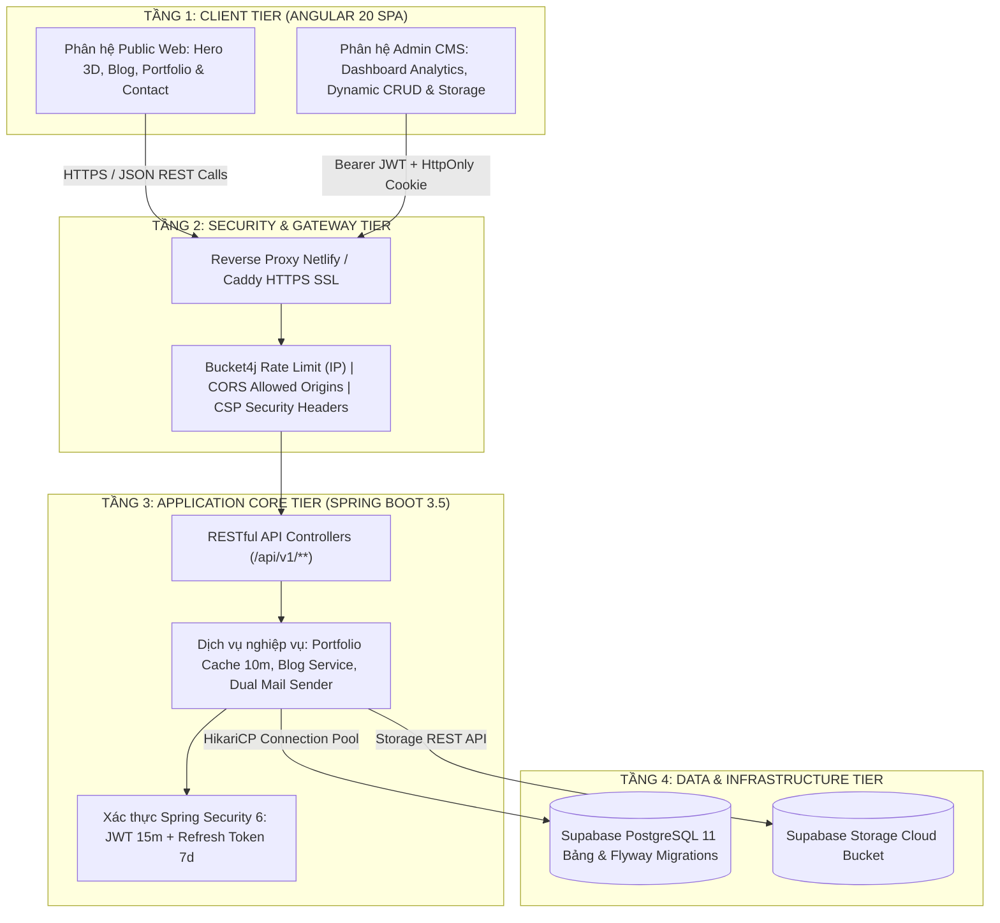
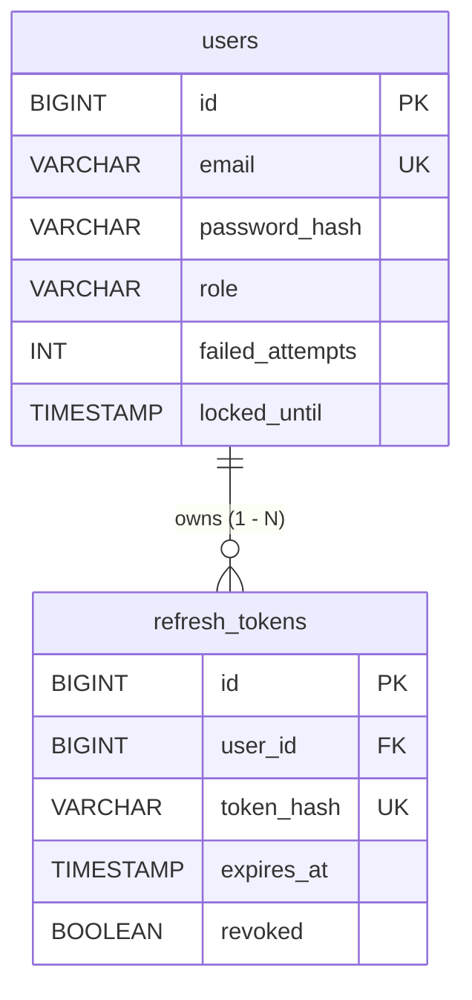
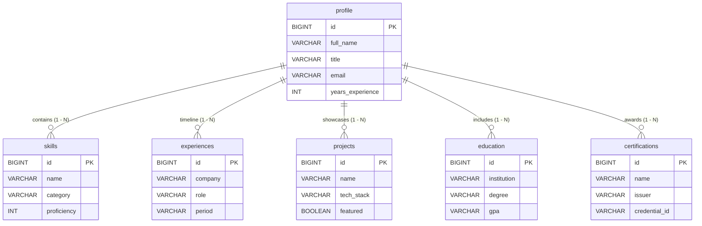
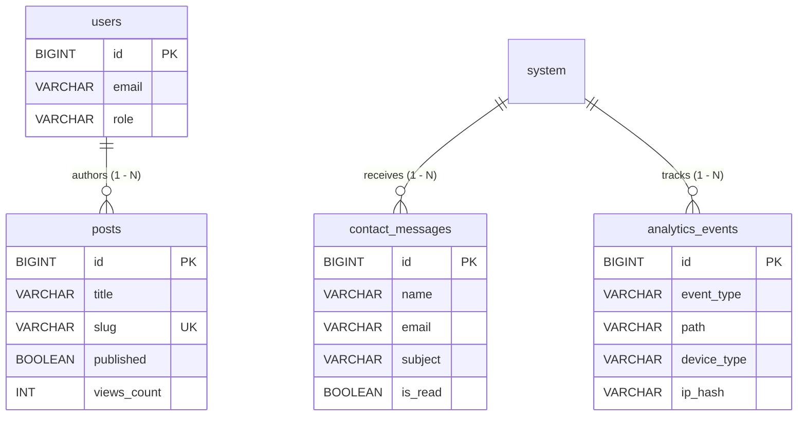

# TÀI LIỆU ĐẶC TẢ YÊU CẦU PHẦN MỀM (SRS)
## SOFTWARE REQUIREMENTS SPECIFICATION
### HỆ THỐNG PORTFOLIO CÁ NHÂN & NỀN TẢNG QUẢN TRỊ NỘI DUNG (HEADLESS CMS)

---

**Thông tin tài liệu:**
- **Dự án:** Personal Portfolio & Admin Management Platform
- **Chủ sở hữu & Kỹ sư phát triển:** Trần Vũ Thiện (Software Development Engineer)
- **Tiêu chuẩn áp dụng:** ISO/IEC/IEEE 29148:2018 (kế thừa cấu trúc IEEE 830-1998)
- **Phiên bản:** 1.0.0
- **Ngày phát hành:** 28/09/2026
- **Trạng thái:** Chính thức (Approved & Baseline)

---

## MỤC LỤC
1. [Giới thiệu tổng quan (Introduction)](#1-giới-thiệu-tổng-quan-introduction)
   - 1.1 Mục đích tài liệu (Purpose)
   - 1.2 Phạm vi sản phẩm (Scope of Project)
   - 1.3 Đối tượng độc giả (Intended Audience)
   - 1.4 Định nghĩa & Thuật ngữ viết tắt (Definitions & Acronyms)
   - 1.5 Tiêu chuẩn & Tài liệu tham chiếu (References & Standards)
   - 1.6 Tổng quan tài liệu (Document Overview)
2. [Mô tả tổng quan hệ thống (Overall Description)](#2-mô-tả-tổng-quan-hệ-thống-overall-description)
   - 2.1 Bối cảnh & Tầm nhìn sản phẩm (Product Perspective & Vision)
   - 2.2 Các phân hệ chức năng chính (Major System Modules)
   - 2.3 Phân loại người dùng & Chân dung người dùng (User Classes & Personas)
   - 2.4 Môi trường vận hành (Operating Environment)
   - 2.5 Ràng buộc về thiết kế & triển khai (Design & Implementation Constraints)
   - 2.6 Giả định & Phụ thuộc (Assumptions & Dependencies)
3. [Kiến trúc kỹ thuật & Hạ tầng (System Architecture)](#3-kiến-trúc-kỹ-thuật--hạ-tầng-system-architecture)
   - 3.1 Cấu trúc Monorepo & Kiến trúc tổng thể (Monorepo & High-Level Architecture)
   - 3.2 Kiến trúc tầng Backend (Spring Boot 3.5 Layered Architecture)
   - 3.3 Kiến trúc Frontend (Angular 20 Standalone, Signals & Three.js)
   - 3.4 Hạ tầng dữ liệu & Lưu trữ (Supabase PostgreSQL, Storage & Cache)
   - 3.5 Kênh thông báo đa phương thức (Dual Mail Sender: SMTP & Resend API)
4. [Đặc tả yêu cầu chức năng chi tiết (System Functional Requirements - FR)](#4-đặc-tả-yêu-cầu-chức-năng-chi-tiết-system-functional-requirements---fr)
   - 4.1 Phân hệ hiển thị Portfolio công khai (FR-01: Public Portfolio Presentation)
   - 4.2 Phân hệ Blog & Chia sẻ kiến thức (FR-02: Technical Blog System)
   - 4.3 Phân hệ Liên hệ & Thông báo Email (FR-03: Contact & Multi-channel Notification)
   - 4.4 Phân hệ Trải nghiệm tương tác & Tiện ích (FR-04: Interactive UX & Modals)
   - 4.5 Phân hệ Giám sát & Phân tích truy cập (FR-05: Real-time Visitor Analytics)
   - 4.6 Phân hệ Xác thực & Bảo mật Admin (FR-06: Authentication & Security)
   - 4.7 Phân hệ Quản trị nội dung Admin Panel (FR-07: Admin CMS & Resource Management)
5. [Thiết kế cơ sở dữ liệu & Quản lý Migration (Data Model & Migrations)](#5-thiết-kế-cơ-sở-dữ-liệu--quản-lý-migration-data-model--migrations)
   - 5.1 Sơ đồ thực thể liên kết (Entity Relationship Diagram - ERD)
   - 5.2 Từ điển dữ liệu chi tiết 11 bảng CSDL (Data Dictionary)
   - 5.3 Quản lý phiên bản CSDL bằng Flyway (V1 Schema, V2 Seed)
6. [Đặc tả giao diện lập trình API (API Specification)](#6-đặc-tả-giao-diện-lập-trình-api-api-specification)
   - 6.1 Chuẩn giao tiếp RESTful & Phong cách thiết kế
   - 6.2 Cấu trúc phản hồi lỗi chuẩn (Global Exception Envelope)
   - 6.3 Danh mục Endpoints chi tiết (Public, Auth, Admin)
7. [Yêu cầu phi chức năng (Non-Functional Requirements - NFR)](#7-yêu-cầu-phi-chức-năng-non-functional-requirements---nfr)
   - 7.1 Hiệu năng & Tốc độ phản hồi (Performance - NFR-01)
   - 7.2 An toàn & Bảo mật thông tin (Security - NFR-02)
   - 7.3 Tính sẵn sàng & Độ tin cậy (Availability & Reliability - NFR-03)
   - 7.4 Khả năng tương thích & Trợ năng (Compatibility & Accessibility - NFR-04)
   - 7.5 Khả năng bảo trì & Mở rộng (Maintainability & Extensibility - NFR-05)
8. [Chiến lược triển khai & DevOps (Deployment & DevOps Strategy)](#8-chiến-lược-triển-khai--devops-deployment--devops-strategy)
   - 8.1 Phương án 1: Render (Backend Docker) + Netlify (Frontend Static Proxy)
   - 8.2 Phương án 2: Oracle Cloud OCI Always Free ARM + Caddy Reverse Proxy
   - 8.3 Quy trình phân nhánh Git (Branching Model: develop -> main)
9. [Ma trận truy vết yêu cầu & Chiến lược kiểm thử (Traceability Matrix & Testing)](#9-ma-trận-truy-vết-yêu-cầu--chiến-lược-kiểm-thử-traceability-matrix--testing)
   - 9.1 Ma trận truy vết yêu cầu (Traceability Matrix)
   - 9.2 Chiến lược kiểm thử tự động (Automated Testing Strategy)

---

## 1. GIỚI THIỆU TỔNG QUAN (INTRODUCTION)

### 1.1 Mục đích tài liệu (Purpose)
Tài liệu này cung cấp bản **Đặc tả Yêu cầu Phần mềm (Software Requirements Specification - SRS)** đầy đủ, toàn diện và có tính chuẩn hóa cao cho dự án **Portfolio Cá nhân & Nền tảng Quản trị Nội dung (Personal Portfolio & Admin Platform)** của Kỹ sư Phần mềm **Trần Vũ Thiện**.

Tài liệu được xây dựng nhằm mục đích:
- Làm cơ sở kỹ thuật chính thức để nghiệm thu, thẩm định chất lượng kiến trúc và mã nguồn của hệ thống.
- Cung cấp tài liệu tham chiếu chuẩn mực cho việc vận hành, bảo trì, mở rộng tính năng và chuyển giao công nghệ.
- Chứng minh năng lực thiết kế phần mềm chuẩn công nghiệp (Enterprise Full-Stack Software Engineering) với công nghệ Java Spring Boot và Angular hiện đại.

### 1.2 Phạm vi sản phẩm (Scope of Project)
Sản phẩm là một hệ thống web application toàn diện, bao gồm 2 phân hệ độc lập nhưng liên kết chặt chẽ:
1. **Public Web Application (Single-Page Application):** Giao diện tương tác trực tiếp với nhà tuyển dụng, khách hàng và cộng đồng lập trình viên. Ứng dụng hiển thị hồ sơ cá nhân, kinh nghiệm làm việc, danh mục dự án, kỹ năng kỹ thuật, chứng chỉ chuyên môn, hệ thống bài viết chuyên môn (Technical Blog), tiện ích xem/tải CV đa ngôn ngữ (EN/VI), terminal giả lập tương tác, và kênh liên hệ trực tuyến.
2. **Headless Admin CMS (Secured Back-office):** Bảng điều khiển quản trị bảo mật cao dành riêng cho chủ sở hữu để cập nhật thông tin cá nhân, thực hiện CRUD (Create/Read/Update/Delete) trên tất cả các tài nguyên, sắp xếp thứ tự hiển thị bằng thao tác kéo thả (drag-and-drop), quản lý tải lên hình ảnh lên Supabase Cloud Storage, theo dõi hộp thư tin nhắn và phân tích số liệu truy cập (Real-time Analytics).

**Ranh giới hệ thống:** Toàn bộ dữ liệu được quản lý tập trung trong hệ quản trị cơ sở dữ liệu PostgreSQL (lưu trữ trên đám mây Supabase), tuyệt đối **không sử dụng mock data hay hard-coded data** ở tầng giao diện người dùng.

### 1.3 Đối tượng độc giả (Intended Audience)
- **Hội đồng thẩm định kỹ thuật / Nhà tuyển dụng:** Đánh giá năng lực thiết kế kiến trúc hệ thống, tư duy tổ chức mã nguồn, tuân thủ tiêu chuẩn kỹ thuật phần mềm và khả năng bảo mật cấp doanh nghiệp.
- **Kỹ sư phát triển / Maintainer:** Sử dụng làm tài liệu tra cứu kiến trúc, schema database, danh mục API và các ràng buộc phi chức năng trong quá trình vận hành hệ thống.
- **Kỹ sư DevOps / Quản trị hệ thống:** Sử dụng cho việc thiết lập hạ tầng đám mây (Render, Netlify, Oracle Cloud Infrastructure, Supabase), triển khai container Docker và cấu hình mạng/SSL.

### 1.4 Định nghĩa & Thuật ngữ viết tắt (Definitions & Acronyms)

| Thuật ngữ / Từ viết tắt | Định nghĩa chi tiết |
| :--- | :--- |
| **SRS** | Software Requirements Specification — Tài liệu đặc tả yêu cầu phần mềm. |
| **SPA** | Single-Page Application — Ứng dụng web tải một trang HTML duy nhất và cập nhật nội dung động mà không tải lại toàn bộ trang. |
| **JWT** | JSON Web Token — Chuẩn mở (RFC 7519) định nghĩa phương thức an toàn truyền tải thông tin định danh giữa các bên dưới dạng JSON object. |
| **RTR** | Refresh Token Rotation — Cơ chế bảo mật tự động cấp mới Refresh Token và hủy bỏ token cũ sau mỗi lần sử dụng nhằm ngăn chặn tấn công chiếm dụng token. |
| **RBAC** | Role-Based Access Control — Cơ chế kiểm soát truy cập dựa trên vai trò của người dùng trong hệ thống. |
| **CORS** | Cross-Origin Resource Sharing — Cơ chế bảo mật của trình duyệt cho phép hoặc hạn chế tài nguyên được truy vấn từ domain khác. |
| **CSP** | Content Security Policy — Tiêu đề HTTP tăng cường bảo mật giúp ngăn chặn các cuộc tấn công Cross-Site Scripting (XSS) và data injection. |
| **DTO** | Data Transfer Object — Mẫu thiết kế đối tượng đóng gói dữ liệu truyền tải giữa các tầng trong phần mềm, tách biệt hoàn toàn với Entity CSDL. |
| **ETL** | Extract, Transform, Load — Quy trình trích xuất, chuyển đổi và nạp dữ liệu. |
| **OCI** | Oracle Cloud Infrastructure — Nền tảng điện toán đám mây của tập đoàn Oracle. |

### 1.5 Tiêu chuẩn & Tài liệu tham chiếu (References & Standards)
- **ISO/IEC/IEEE 29148:2018:** Systems and software engineering — Life cycle processes — Requirements engineering.
- **IEEE Std 830-1998:** IEEE Recommended Practice for Software Requirements Specifications (chuẩn kế thừa).
- **RFC 7519:** JSON Web Token (JWT) Specification.
- **RFC 6749:** The OAuth 2.0 Authorization Framework (Refresh Token guidelines).
- **OWASP Top 10 Web Application Security Risks (2021).**
- **WCAG 2.1:** Web Content Accessibility Guidelines (Level AA).

### 1.6 Tổng quan tài liệu (Document Overview)
Tài liệu được chia thành 9 chương logic: Chương 2 mô tả tầm nhìn tổng quan; Chương 3 đi sâu vào kiến trúc monorepo và các tầng công nghệ; Chương 4 đặc tả chi tiết 7 phân hệ chức năng cốt lõi; Chương 5 cung cấp thiết kế dữ liệu 11 bảng và chiến lược migration; Chương 6 chi tiết hóa giao tiếp API RESTful; Chương 7 phân tích các yêu cầu phi chức năng khắt khe; Chương 8 trình bày giải pháp DevOps/Cloud; và Chương 9 tổng kết ma trận truy vết và kế hoạch kiểm thử.

---

## 2. MÔ TẢ TỔNG QUAN HỆ THỐNG (OVERALL DESCRIPTION)

### 2.1 Bối cảnh & Tầm nhìn sản phẩm (Product Perspective & Vision)
Trong kỷ nguyên kỹ thuật số hiện đại, một hồ sơ năng lực cá nhân (portfolio) không chỉ đơn thuần là bản tóm tắt tiểu sử dạng tĩnh, mà là một **sản phẩm phần mềm thực thụ** phản ánh toàn diện trình độ tư duy kỹ thuật, gu thẩm mỹ giao diện người dùng (UI/UX), năng lực bảo mật và sự thành thạo trong việc triển khai các hệ thống phân tán, đám mây.

Hệ thống được định vị là một **Modern Full-Stack Personal Platform**:
- Đem đến trải nghiệm trực quan ấn tượng (WOW Effect) với ngôn ngữ thiết kế pastel blue-purple, hiệu ứng glassmorphism, tương tác không gian ba chiều (3D Three.js Lazy-loaded), và hoạt cảnh mượt mà 60fps.
- Cung cấp nền tảng quản trị nội dung độc lập (Headless CMS) giúp việc biên tập hồ sơ, kỹ năng, dự án, bài viết blog diễn ra theo thời gian thực mà không bao giờ cần phải chỉnh sửa hay rebuild lại mã nguồn giao diện.

### 2.2 Kiến trúc phân tầng & Các phân hệ chức năng chính (System Architecture & Major Modules)

Hệ thống được thiết kế theo mô hình kiến trúc phân tầng 4 lớp hiện đại (4-Tier Enterprise Architecture), phân định rõ ràng ranh giới trách nhiệm giữa các tầng giao diện người dùng, cổng bảo mật & điều phối, tầng dịch vụ lõi và tầng lưu trữ đám mây.

#### Sơ đồ 2.1: Sơ đồ kiến trúc phân tầng 4 lớp tổng thể


#### 2.2.1 Phân hệ 1: Public Web SPA (Giao diện người dùng công khai)
Phân hệ Public Web hướng đến các đối tượng người dùng bên ngoài như nhà tuyển dụng, đối tác và cộng đồng lập trình viên. Phân hệ được xây dựng bằng **Angular 20 Standalone Components** kết hợp **TailwindCSS 3** và đồ họa không gian 3 chiều **Three.js**:
- **Trải nghiệm thị giác trực quan:** Áp dụng bảng màu Pastel Blue-Purple, hiệu ứng Glassmorphism bán trong suốt, hoạt cảnh 60fps mượt mà và chuyển đổi giao diện Sáng/Tối (Light/Dark Mode).
- **Hồ sơ năng lực động:** Toàn bộ thông tin tiểu sử, kỹ năng, kinh nghiệm và dự án được nạp động từ API tổng hợp `/api/v1/portfolio` với cơ chế cache in-memory 10 phút, đảm bảo tốc độ phản hồi dưới 100ms.
- **Nền tảng chia sẻ kiến thức:** Chuyên mục Technical Blog tích hợp trình đọc Markdown, hỗ trợ hiển thị đoạn mã đa ngôn ngữ có syntax highlighting và bộ đếm lượt xem bài viết.
- **Kênh tương tác trực tiếp:** Form liên hệ trực tuyến có kiểm thực chặt chẽ, kiểm soát tốc độ gửi tối đa 3 lần/phút/IP để ngăn chặn thư rác, đồng thời kích hoạt quy trình gửi email thông báo ngầm cho quản trị viên.
- **Tiện ích mở rộng tương tác:** Terminal giả lập (phím tắt `Ctrl + ~`), cửa sổ xem trước và tải CV đa ngôn ngữ trực tiếp (tiếng Việt và tiếng Anh) và bộ đếm thống kê GitHub thời gian thực.

#### 2.2.2 Phân hệ 2: Admin CMS (Nền tảng quản trị nội dung an toàn)
Phân hệ Admin CMS là không gian làm việc bảo mật cao dành riêng cho chủ nhân hồ sơ để điều hành toàn bộ dữ liệu hệ thống mà không cần can thiệp vào mã nguồn:
- **Bảo mật xác thực đa tầng:** Sử dụng Spring Security 6 với kiến trúc mã hóa BCrypt cost 12, Dummy-hash Timing chống rà quét tài khoản, và cơ chế khóa tài khoản tự động trong 15 phút nếu nhập sai mật khẩu 5 lần liên tiếp.
- **Quản lý phiên làm việc tiên tiến:** Cấp phát cặp token bao gồm Access Token JWT thời hạn ngắn (15 phút) lưu trên bộ nhớ RAM và Refresh Token thời hạn dài (7 ngày) lưu trong cookie an toàn `HttpOnly; Secure; SameSite=Strict`, hỗ trợ cơ chế xoay vòng token (RTR) và phát hiện đánh cắp phiên.
- **Trung tâm điều hành Analytics Dashboard:** Biểu đồ giám sát thời gian thực về tổng lượt xem, số lượng người dùng duy nhất, tỷ lệ thiết bị truy cập và các bài viết được quan tâm nhiều nhất.
- **Quản lý toàn diện tài nguyên (Dynamic CRUD):** Biên tập 6 thực thể dữ liệu (Kỹ năng, Kinh nghiệm, Dự án, Học vấn, Chứng chỉ, Bài viết Blog) kèm tính năng kéo thả (Drag-and-Drop) sắp xếp lại vị trí hiển thị tức thì.
- **Hộp thư liên hệ & Quản lý tệp đám mây:** Tiếp nhận và duyệt tin nhắn từ khách truy cập, tải lên trực tiếp các tệp ảnh đại diện hoặc ảnh dự án lên Supabase Storage với kiểm tra định dạng và giới hạn dung lượng ≤ 2MB.

#### 2.2.3 Phân hệ 3: Backend API & Dịch vụ nền tảng (Core Services & Infrastructure)
Tầng dịch vụ nền tảng đóng vai trò trung tâm xử lý dữ liệu và tích hợp hạ tầng:
- **Chuẩn hóa RESTful Services:** Cung cấp hệ thống API theo chuẩn RESTful tại tiền tố `/api/v1`, chuẩn hóa định dạng phản hồi toàn cục (Global Response Envelope) và cơ chế xử lý ngoại lệ tập trung.
- **Bảo vệ mạng đa tầng:** Tích hợp Bucket4j để giới hạn tốc độ truy cập per IP, cấu hình CORS nghiêm ngặt chỉ chấp nhận các tên miền được chỉ định, cùng bộ tiêu đề an ninh HTTP (HSTS, CSP, X-Frame-Options).
- **Kiến trúc gửi thư Dual Mail Sender:** Tự động phát hiện và chuyển đổi linh hoạt giữa giao thức SMTP truyền thống và Resend HTTPS API (cổng 443 không bao giờ bị chặn bởi tường lửa đám mây), đảm bảo độ tin cậy thông báo đạt 99.9%.
- **Quản trị CSDL và Migration tự động:** Quản lý 11 bảng dữ liệu trên Supabase PostgreSQL thông qua Flyway Migrations, bảo đảm tính nhất quán cấu trúc cơ sở dữ liệu trên mọi môi trường triển khai.

#### Bảng 2.2: Bảng phân rã chi tiết kiến trúc & trách nhiệm chức năng

| Phân hệ chính | Thành phần / Chức năng con | Công nghệ chủ đạo | Trách nhiệm & Mô tả hoạt động |
| :--- | :--- | :--- | :--- |
| **1. Public Web** | Trang chủ tương tác | Angular 20, TailwindCSS, three.js | Hiển thị Hero 3D, About, kỹ năng với thanh đo %, timeline kinh nghiệm trượt 2 bên, lưới dự án kèm bộ lọc công nghệ. |
| | Technical Blog | Angular, Markdown Renderer | Danh sách bài viết `/blog`, đọc chi tiết bài viết `/blog/:slug`, syntax highlight cho code block, bộ đếm lượt xem. |
| | Kênh liên hệ trực tuyến | Reactive Forms, Rate Limit | Form nhập thông điệp liên hệ, xác thực dữ liệu tức thì, rate-limit 3 req/phút/IP, kích hoạt gửi mail thông báo ngầm. |
| | Tiện ích tương tác | Angular Signals, CDK | Terminal giả lập (`Ctrl + ~`), Modal xem/tải CV đa ngôn ngữ (`/cv-vi.pdf`, `/cv-en.pdf`), GitHub live stats counter. |
| **2. Admin CMS** | Xác thực & Quản lý phiên | Spring Security 6, JWT, BCrypt | Đăng nhập tài khoản quản trị, cấp JWT 15m + Refresh Token 7 ngày qua HttpOnly Cookie, khóa tài khoản khi sai 5 lần. |
| | Dashboard Analytics | Chart / Signal state | Biểu đồ theo dõi tổng lượt xem, người dùng duy nhất, tỷ lệ thiết bị (desktop/mobile) và danh sách bài viết xem nhiều nhất. |
| | Quản lý tài nguyên CMS | Angular Dynamic CRUD | Toàn diện Create/Read/Update/Delete 6 thực thể (kỹ năng, kinh nghiệm, dự án, học vấn, chứng chỉ, bài viết); kéo thả sắp xếp thứ tự. |
| | Hộp thư & Lưu trữ tệp | Supabase Storage REST API | Xem và quản lý tin nhắn liên hệ gửi đến, tải ảnh avatar/dự án lên bucket đám mây với kiểm tra định dạng và dung lượng ≤2MB. |
| **3. Backend & Hạ tầng** | REST API & Caching | Spring Boot 3.5, Cacheable | Cung cấp chuẩn REST API `/api/v1`, endpoint tổng hợp `/portfolio` cache 10 phút, Global Exception Envelope chuẩn hóa. |
| | Bảo mật mạng đa tầng | Bucket4j, CORS, HSTS, CSP | Giới hạn tốc độ request per IP, kiểm soát chặt domain gọi API qua CORS allowed origins, tiêu đề an ninh HTTP chống XSS/Clickjacking. |
| | Gửi Email bất đồng bộ | JavaMail, Resend HTTPS API | Kiến trúc Dual Mail Sender: tự động chuyển đổi giữa Gmail SMTP và Resend API (cổng 443 không bị chặn bởi đám mây). |
| | Cơ sở dữ liệu & DevOps | Supabase PostgreSQL, Flyway | Quản lý 11 bảng CSDL, tự động nạp dữ liệu và kiểm soát phiên bản qua Flyway migrations (`V1__schema.sql`, `V2__seed.sql`). |

### 2.3 Phân loại người dùng & Chân dung người dùng (User Classes & Personas)

| Nhóm người dùng | Mục tiêu & Hành vi tương tác | Quyền hạn trên hệ thống |
| :--- | :--- | :--- |
| **Nhà tuyển dụng / Khách hàng (Public Visitor)** | - Khảo sát hồ sơ năng lực, bằng cấp, dự án.<br>- Tải xuống và xem CV định dạng PDF tiếng Việt / tiếng Anh.<br>- Tìm kiếm và lọc dự án theo ngăn xếp công nghệ.<br>- Đọc các bài viết kỹ thuật trên Blog.<br>- Gửi thông tin liên hệ, đặt vấn đề hợp tác. | Quyền truy cập các API công khai (`GET /api/v1/**`, `POST /api/v1/contact`, `POST /api/v1/analytics/track`). |
| **Lập trình viên / Đồng nghiệp (Tech Explorer)** | - Khám phá các tiện ích mở rộng: phím tắt `Ctrl + ~` (Terminal tương tác), `Ctrl + K` (Command Palette).<br>- Kiểm tra các số liệu live commit/repository từ GitHub API.<br>- Kiểm tra phản hồi API qua Swagger UI. | Quyền công khai, quyền tương tác tiện ích client. |
| **Quản trị viên (Trần Vũ Thiện - Administrator)** | - Đăng nhập tài khoản định danh quản trị.<br>- Quản lý toàn bộ vòng đời dữ liệu (CRUD, Reorder).<br>- Đọc, đánh dấu, xóa các tin nhắn liên hệ gửi đến.<br>- Xem biểu đồ số liệu thống kê truy cập hệ thống.<br>- Đăng tải và chỉnh sửa bài viết kỹ thuật. | Quyền tối cao (`ROLE_ADMIN`), truy cập toàn bộ các endpoint bảo mật `/api/v1/admin/**`. |

### 2.4 Môi trường vận hành (Operating Environment)
- **Hệ điều hành máy chủ:** Linux (Ubuntu 22.04 LTS / 24.04 LTS) hoặc container Docker (`eclipse-temurin:21-jre-alpine`).
- **Phía Client:** Các trình duyệt web hiện đại hỗ trợ ECMAScript 2022+ và WebGL (Google Chrome, Mozilla Firefox, Microsoft Edge, Apple Safari).
- **Môi trường Database:** PostgreSQL 15+ trên hạ tầng Supabase Cloud hoặc PostgreSQL Docker nội bộ.
- **Hạ tầng triển khai Production:**
  - *Mô hình 1:* Render Web Service (Docker Backend) kết hợp Netlify Edge Network (Angular SPA).
  - *Mô hình 2:* Oracle Cloud Infrastructure (OCI) Compute Instance (Ampere ARM A1, 4 OCPU, 24 GB RAM) kết hợp Caddy Web Server tự động cấp chứng chỉ Let's Encrypt SSL.

### 2.5 Ràng buộc về thiết kế & triển khai (Design & Implementation Constraints)
1. **Kiến trúc mã nguồn:** Bắt buộc tuân thủ cấu trúc Monorepo với 2 thư mục gốc độc lập `/backend` và `/frontend`.
2. **Ngăn xếp công nghệ bắt buộc:**
   - Backend: Java 21 LTS, Spring Boot 3.5.x, Spring Data JPA, Spring Security 6, Flyway 10+, Bucket4j.
   - Frontend: Angular 20.x (Standalone Components, Signals, Router standalone), TailwindCSS 3.x, three.js 0.170+.
3. **Bảo mật thông tin:** Tuyệt đối không hard-code bất kỳ secret key, token, mật khẩu CSDL nào trong mã nguồn. Mọi cấu hình nhạy cảm phải nạp qua biến môi trường (`.env`).
4. **Hiệu suất giao diện:** Ứng dụng phải đạt chỉ số Google Lighthouse tối thiểu 90 điểm trên cả 4 hạng mục (Performance, Accessibility, Best Practices, SEO). Hoạt cảnh đồ họa ba chiều Three.js phải được tải dưới dạng lazy-loaded chunk để tránh ảnh hưởng đến chỉ số First Contentful Paint (FCP).

### 2.6 Giả định & Phụ thuộc (Assumptions & Dependencies)
- Hệ thống giả định dịch vụ Supabase Database và Supabase Storage luôn đạt chỉ số khả dụng (SLA) từ 99.9% trở lên.
- Phân hệ gửi email phụ thuộc vào API của nhà cung cấp Resend hoặc cổng SMTP của Google Gmail. Trường hợp mạng outbound bị chặn (ví dụ môi trường Render Free), hệ thống tự động sử dụng Resend HTTPS API qua cổng 443.

---

## 3. KIẾN TRÚC KỸ THUẬT & HẠ TẦNG (SYSTEM ARCHITECTURE)

### 3.1 Cấu trúc Monorepo & Kiến trúc tổng thể (Monorepo & High-Level Architecture)
Dự án được tổ chức theo chuẩn Monorepo công nghiệp:

```
d:\portfolio\
├── backend/                       # Ứng dụng máy chủ Spring Boot (REST API)
│   ├── src/main/java/             # Mã nguồn Java nghiệp vụ
│   ├── src/main/resources/        # Cấu hình application.yml & Flyway migration scripts
│   ├── src/test/java/             # Bộ kiểm thử Unit Test & Integration Test
│   ├── Dockerfile                 # Multi-stage Docker build cho Backend
│   └── pom.xml                    # Quản lý thư viện Maven
├── frontend/                      # Ứng dụng giao diện người dùng Angular 20 SPA
│   ├── src/app/                   # Modules: core, pages, shared, three, admin
│   ├── public/                    # Tài nguyên tĩnh: cv.pdf, sitemap.xml, robots.txt, icons
│   ├── proxy.conf.json            # Cấu hình Reverse Proxy cho môi trường phát triển local
│   ├── tailwind.config.js         # Hệ thống Design Tokens & Theme pastel
│   └── package.json               # Quản lý phụ thuộc Node.js
├── docs/                          # Tài liệu kỹ thuật, kiến trúc & SRS chuẩn mực
├── docker-compose.yml             # Cấu hình chạy toàn bộ hệ thống bằng Docker
├── netlify.toml                   # Cấu hình triển khai & Proxy rewrite trên Netlify
├── render.yaml                    # Blueprint triển khai tự động hạ tầng trên Render
├── README.md                      # Tài liệu tổng quan dự án (Tiếng Việt)
└── README2.md                     # Cẩm nang triển khai Oracle Cloud Infrastructure
```

### 3.2 Kiến trúc tầng Backend (Spring Boot 3.5 Layered Architecture)
Backend áp dụng kiến trúc phân tầng kinh điển (Layered Architecture) kết hợp mô hình Domain-Driven Design (DDD) thu nhỏ:
- **Presentation Layer (Web/REST):** Tiếp nhận HTTP Request, xử lý validation qua Jakarta Bean Validation, mapping DTO và định tuyến phản hồi. Tách biệt rõ giữa `PublicController`, `AnalyticsController`, `AuthController` và các `Admin*Controller`.
- **Security & Filter Layer:** Bộ lọc `RateLimitFilter` (Bucket4j kiểm soát số lượng request trên từng IP), `JwtAuthenticationFilter` (kiểm tra Bearer token trong Header `Authorization`), xử lý lỗi xác thực không hợp lệ với `SecurityConfig`.
- **Service Layer (Business Logic):** Thực thi toàn bộ quy tắc nghiệp vụ, điều phối giao dịch (`@Transactional`), quản lý bộ nhớ đệm (`@Cacheable`, `@CacheEvict`), băm mật khẩu, xử lý gửi email bất đồng bộ (`@Async`).
- **Data Access Layer (Repository):** Sử dụng Spring Data JPA tương tác với PostgreSQL thông qua các interface kế thừa `JpaRepository`.
- **Infrastructure & Storage:** Giao tiếp với Supabase Storage API bằng HTTP client nội bộ (`RestClient` / `HttpClient`), kiểm tra MIME type và giới hạn dung lượng tải lên.

### 3.3 Kiến trúc Frontend (Angular 20 Standalone, Signals & Three.js)
Frontend loại bỏ hoàn toàn mô hình `NgModule` truyền thống, chuyển đổi 100% sang kiến trúc **Angular Standalone Components**:
- **Reactivity Model (Angular Signals):** Sử dụng các nguyên thủy `signal()`, `computed()`, `effect()` để quản lý trạng thái giao diện nội bộ, giúp phát hiện thay đổi cực nhanh (fine-grained change detection) mà không làm tăng gánh nặng của Zone.js.
- **Routing & Lazy-loading:** Tách tuyến đường rõ ràng giữa nhánh công khai (Public Site: `/`, `/blog`, `/blog/:slug`) và nhánh quản trị (Admin Panel: `/admin/**` được bảo vệ bởi `authGuard`).
- **3D Graphics Engine (Three.js):** Hoạt cảnh hệ mặt trời ba chiều (Solar System) tại Hero Section được đóng gói thành module độc lập, chỉ được tải về trình duyệt khi người dùng cuộn tới hoặc trình duyệt hoàn tất nạp khung nhìn chính, giúp tối ưu tối đa dung lượng tải trang ban đầu.
- **CSS Architecture:** TailwindCSS 3 kết hợp các biến tùy chỉnh (CSS Variables) hỗ trợ đổi Theme Sáng/Tối (Light/Dark mode) và hiệu ứng chuyển tông mượt mà.

### 3.4 Hạ tầng dữ liệu & Lưu trữ (Supabase PostgreSQL, Storage & Cache)
- **Supabase PostgreSQL:** Cung cấp cơ sở dữ liệu quan hệ mạnh mẽ, kết nối qua cổng Session Pooler 5432 nhằm tương thích tối ưu với các hệ thống backend chạy trong container Docker (hỗ trợ đầy đủ IPv4).
- **Supabase Storage:** Lưu trữ phân tán các tệp ảnh tĩnh công khai (avatar đại diện cá nhân, ảnh chụp màn hình dự án, ảnh bìa bài viết blog) thông qua bucket `portfolio`.
- **Spring Cache Layer:** Tích hợp bộ nhớ đệm `ConcurrentMapCacheManager` cho các endpoint dữ liệu tĩnh ít thay đổi (`/api/v1/portfolio` cache trong 10 phút). Khi admin thực hiện bất kỳ thao tác cập nhật dữ liệu nào, hệ thống tự động xóa bộ nhớ đệm (`@CacheEvict`) để đảm bảo dữ liệu hiển thị tức thì.

### 3.5 Kênh thông báo đa phương thức (Dual Mail Sender: SMTP & Resend API)
Hệ thống giải quyết triệt để vấn đề các nhà cung cấp đám mây miễn phí (như Render, Vercel) thường chặn cổng gửi thư truyền thống (cổng 25, 465, 587) bằng kiến trúc **Dual Mail Sender**:
- **Kênh SMTP (SmtpContactMailSender):** Hoạt động qua JavaMailSender, kết nối tới máy chủ Gmail SMTP khi chạy tại môi trường local, Docker nội bộ hoặc máy chủ ảo có mở cổng mạng.
- **Kênh Resend HTTPS API (ResendContactMailSender):** Thực hiện cuộc gọi REST API qua giao thức HTTPS (cổng 443) tới dịch vụ `https://api.resend.com/emails`. Không bao giờ bị chặn bởi tường lửa mạng đám mây.
- **Tự động chuyển đổi (MailSenderConfig):** Đọc biến môi trường `MAIL_PROVIDER` (`smtp` hoặc `resend`) khi hệ thống khởi động để đăng ký Bean tương ứng vào Spring Application Context.

---

## 4. ĐẶC TẢ YÊU CẦU CHỨC NĂNG CHI TIẾT (SYSTEM FUNCTIONAL REQUIREMENTS - FR)

### 4.1 Phân hệ hiển thị Portfolio công khai (FR-01: Public Portfolio Presentation)

#### 4.1.1 Khối tương tác đầu trang (FR-01.1: Hero Section & 3D Interactive Canvas)
- **Mô tả nghiệp vụ:** Khối giao diện đầu tiên tiếp cận người xem khi truy cập trang web. Thể hiện nhận diện thương hiệu cá nhân với ảnh đại diện có vòng sáng gradient động, tên kỹ sư, hiệu ứng gõ chữ tuần hoàn (Typing effect) qua các vai trò chuyên môn (*"Software Development Engineer"*, *"Full-Stack Java Developer"*, *"Spring Boot & Angular Specialist"*), 2 nút hành động chính (Call To Action - CTA): *"Xem Dự Án"* (cuộn mượt xuống section Projects) và *"Tải CV"* (mở cửa sổ tương tác xem và tải CV).
- **Hạ tầng đồ họa 3D Three.js:** Khung vẽ Three.js tái hiện không gian vũ trụ được tải bất đồng bộ (lazy-loaded). Chuyển động của các thiên thể phản hồi vi mô theo vị trí con trỏ chuột của người dùng. Hệ thống tự động kiểm tra năng lực phần cứng và màn hình; trên thiết bị di động, hoạt cảnh Three.js được giảm tải xuống 30fps hoặc thay thế bằng CSS gradient động để tối ưu hóa thời lượng pin.
- **Giao tiếp API:** Gọi `GET /api/v1/portfolio` tại thời điểm khởi tạo ứng dụng. Nhận đối tượng DTO chứa `full_name`, `title`, `typing_roles`, `avatar_url`, `cv_url`.
- **Quy tắc nghiệp vụ & Xử lý ngoại lệ:** Dữ liệu được quản lý tập trung trong Signal `profileSignal`. Nếu API gặp sự cố, hệ thống tự động sử dụng Fallback Mock Data để đảm bảo trải nghiệm giao diện không bị gián đoạn.

#### 4.1.2 Khối giới thiệu hồ sơ cá nhân (FR-01.2: About Me & Career Highlights)
- **Mô tả nghiệp vụ:** Trình bày định hướng chuyên môn sâu về kiến trúc hệ thống phân tán, xử lý backend hiệu năng cao và phát triển ứng dụng web hiện đại.
- **Bộ đếm số liệu động (Quick Stats Count-Up):** Hiển thị các chỉ số ấn tượng: Số năm kinh nghiệm làm việc thực tế, số lượng dự án đã hoàn thành, số lượng công nghệ thành thạo. Chỉ số bắt đầu đếm số tăng dần từ 0 lên giá trị thực tế ngay khi phần tử cuộn vào khung nhìn (Intersection Observer API).
- **Sở thích cá nhân & Liên kết mạng xã hội:** Các liên kết tới GitHub, LinkedIn, Facebook có thuộc tính an toàn `target="_blank" rel="noopener noreferrer"`.

#### 4.1.3 Khối ma trận kỹ năng chuyên môn (FR-01.3: Technical Skills Matrix)
- **Mô tả nghiệp vụ:** Phân loại toàn bộ năng lực kỹ thuật thành 5 nhóm chuyên biệt: *Backend & Frameworks*, *Frontend & UI/UX*, *Database & Caching*, *Messaging & Architecture*, *DevOps, Cloud & Tools*.
- **Hiệu ứng trực quan:** Mỗi kỹ năng hiển thị tên, biểu tượng công nghệ và thanh đo độ thành thạo dạng phần trăm (0 - 100%). Thanh phần trăm tự động kích hoạt hiệu ứng chạy đầy (progress animation) khi người dùng cuộn đến. Khi rê chuột (hover), thẻ kỹ năng áp dụng hiệu ứng nghiêng không gian 3 chiều (3D Tilt Effect).

#### 4.1.4 Khối lộ trình kinh nghiệm làm việc (FR-01.4: Professional Experience Timeline)
- **Mô tả nghiệp vụ:** Trục thời gian dọc (Vertical Timeline) mô tả quá trình công tác tại các tập đoàn và doanh nghiệp công nghệ (Viettel Telecom, Migi Technology, HCLTech Vietnam).
- **Hiệu ứng trượt xen kẽ:** Các thẻ kinh nghiệm trượt mượt mà từ hai phía trái và phải vào tâm trục thời gian, đi kèm điểm nối phát sáng tuần hoàn (pulsing glowing dots).
- **Nội dung thẻ:** Thời gian công tác, chức danh, tên công ty, mô tả thành tựu kỹ thuật cụ thể và danh sách các thẻ công nghệ (tech chips) nổi bật đã sử dụng.

#### 4.1.5 Khối danh mục dự án tiêu biểu (FR-01.5: Projects Showcase & Tag Filtering)
- **Mô tả nghiệp vụ:** Bố cục dạng lưới đáp ứng (Responsive Grid) trình diễn các sản phẩm phần mềm thực tế.
- **Bộ lọc công nghệ tức thời (Instant Filter Engine):** Thanh lọc các tag công nghệ (All, Java, Spring Boot, Angular, Docker, Database...). Khi người dùng click chọn tag, lưới dự án tái cấu trúc mượt mà bằng hoạt cảnh layout animation không gây giật lag.
- **Thẻ dự án:** Hiển thị ảnh bìa sắc nét, tiêu đề, tóm tắt bài toán kỹ thuật, tag công nghệ, huy hiệu "Featured" cho các dự án trọng điểm, cùng các nút liên kết trực tiếp tới Demo trực tuyến và Repository GitHub.

#### 4.1.6 Khối học vấn & Chứng chỉ nghề nghiệp (FR-01.6: Education & Verified Certifications)
- **Mô tả nghiệp vụ:** Bằng Cử nhân Công nghệ Thông tin tại Viện Đại học Mở Hà Nội (chuyên ngành Công nghệ Phần mềm) và danh mục chứng chỉ chuyên ngành quốc tế kèm mã số xác minh (Credential ID) và đường dẫn kiểm tra trực tiếp trên nền tảng cấp chứng chỉ.

---

### 4.2 Phân hệ Blog kỹ thuật & Chia sẻ kiến thức (FR-02: Technical Blog System)

#### 4.2.1 Trang danh mục bài viết công khai (FR-02.1: Blog Hub `/blog`)
- **Mô tả nghiệp vụ:** Cung cấp không gian chia sẻ các bài viết chuyên sâu về kiến trúc phần mềm, kinh nghiệm lập trình Java/Spring Boot, tối ưu hóa Angular và triển khai hạ tầng đám mây.
- **Tiêu chí hiển thị:** Chỉ tải và hiển thị các bài viết có cờ trạng thái `published = true`, sắp xếp theo độ ưu tiên `sort_order` và ngày xuất bản mới nhất.
- **Tìm kiếm & Phân trang:** Hỗ trợ tìm kiếm bài viết theo từ khóa tiêu đề hoặc tóm tắt, lọc bài viết theo nhãn kỹ thuật (tags). Tích hợp phân trang dữ liệu (Pagination) tối ưu hóa băng thông.
- **API Hỗ trợ:** `GET /api/v1/posts?page=0&size=9&tag=...`

#### 4.2.2 Trình đọc bài viết Markdown chuyên sâu (FR-02.2: Markdown Article Reader `/blog/:slug`)
- **Mô tả nghiệp vụ:** Hiển thị chi tiết nội dung bài viết theo đường dẫn thân thiện SEO (Slug URL).
- **Bộ xử lý Markdown:** Tích hợp bộ chuyển đổi Markdown sang HTML hỗ trợ đầy đủ các định dạng: Khối mã nguồn (Code Blocks) với tính năng Highlight cú pháp đa ngôn ngữ (Java, TypeScript, SQL, Bash, YAML) kèm nút Copy mã nguồn nhanh, bảng biểu số liệu, khối trích dẫn (Blockquotes), danh sách đánh số/gạch đầu dòng và hình ảnh có phóng to khi click.
- **Tự động tính thời gian đọc:** Dựa trên thuật toán đếm số từ trong bài viết (trung bình 200 từ/phút) để xuất ra số phút ước lượng (`reading_time_minutes`).
- **Tự động tăng bộ đếm lượt xem (Atomic View Counter):** Khi người xem truy cập bài viết, client gửi request ngầm `POST /api/v1/posts/{slug}/view`. Backend thực hiện câu lệnh SQL nguyên tử `UPDATE posts SET views_count = views_count + 1 WHERE id = ...` kèm cơ chế chống tăng ảo khi reload liên tục trong cùng 1 phiên.

#### 4.2.3 Quản lý trạng thái xuất bản & Tối ưu hóa SEO (FR-02.3: SEO & Publishing Lifecycle)
- **Mô tả nghiệp vụ:** Mỗi bài viết đều có đầy đủ Open Graph meta tags (og:title, og:description, og:image) để hiển thị thẻ xem trước đẹp mắt khi chia sẻ liên kết lên Facebook, LinkedIn, Twitter/X. Tích hợp nút chia sẻ mạng xã hội 1-click.

---

### 4.3 Phân hệ Kênh liên hệ & Dịch vụ gửi Email bất đồng bộ (FR-03: Contact & Multi-channel Notification)

#### 4.3.1 Biểu mẫu liên hệ trực tuyến (FR-03.1: Contact Form & Validation)
- **Mô tả nghiệp vụ:** Cung cấp kênh trao đổi trực tiếp giữa khách truy cập/nhà tuyển dụng và chủ nhân hồ sơ.
- **Quy tắc kiểm thực dữ liệu (Validation Rules):**
  - `name`: Bắt buộc, độ dài từ 2 đến 120 ký tự, không chứa mã độc HTML/Script.
  - `email`: Bắt buộc, đúng định dạng email tiêu chuẩn RFC 5322, tối đa 160 ký tự.
  - `subject`: Bắt buộc, độ dài từ 3 đến 200 ký tự.
  - `message`: Bắt buộc, độ dài từ 10 đến 3000 ký tự.
- **Cơ chế chống thư rác (Spam Mitigation):** Áp dụng Bucket4j Rate-limiting ở tầng API Gateway: mỗi địa chỉ IP chỉ được phép gửi tối đa 3 tin nhắn trong vòng 1 phút. Nếu vượt ngưỡng, hệ thống trả về mã lỗi HTTP 429 Too Many Requests kèm thông báo thời gian cần chờ.

#### 4.3.2 Ghi nhận CSDL & Xử lý chạy ngầm (FR-03.2: Async Storage & Event Processing)
- **Điểm cuối API:** `POST /api/v1/contact`
- **Quy trình xử lý:**
  1. Backend kiểm tra tính hợp lệ của DTO qua Jakarta Bean Validation (`@Valid`).
  2. Lưu thông điệp vào bảng `contact_messages` với trạng thái `is_read = false`.
  3. Kích hoạt phương thức gửi thư bất đồng bộ `@Async("taskExecutor")` của `ContactNotificationService`.
  4. Trả về ngay lập tức phản hồi HTTP 200 OK với thông điệp cảm ơn, giúp người dùng không phải chờ đợi thời gian gửi email (thường mất từ 1-3 giây).

#### 4.3.3 Kiến trúc Dual Mail Sender (FR-03.3: Intelligent Mail Fallback)
- **Vấn đề giải quyết:** Các nền tảng điện toán đám mây serverless/container miễn phí thường khóa các cổng gửi thư SMTP truyền thống (cổng 25, 465, 587) để ngăn chặn thư rác.
- **Giải pháp chuyển đổi tự động:**
  - **Kênh Resend HTTPS API (`ResendContactMailSender`):** Gửi yêu cầu qua giao thức HTTPS cổng 443 tới endpoint `https://api.resend.com/emails`. Cổng 443 không bao giờ bị chặn bởi bất kỳ nhà cung cấp đám mây nào.
  - **Kênh SMTP (`SmtpContactMailSender`):** Hoạt động qua JavaMail kết nối tới máy chủ Gmail SMTP khi chạy trên máy chủ ảo chuyên dụng (như Oracle Cloud OCI) hoặc môi trường phát triển cục bộ.
  - **Điều khiển qua cấu hình:** Đọc biến môi trường `MAIL_PROVIDER` khi khởi động Spring Boot để nạp Bean phù hợp vào Application Context.

---

### 4.4 Phân hệ Tiện ích tương tác & Trải nghiệm người dùng cao cấp (FR-04: Advanced Interactive UX)

#### 4.4.1 Cửa sổ dòng lệnh Terminal giả lập (FR-04.1: Interactive Terminal Modal)
- **Mô tả nghiệp vụ:** Tiện ích độc đáo dành cho các kỹ sư công nghệ và nhà tuyển dụng muốn khám phá hồ sơ theo phong cách lập trình viên chuyên nghiệp.
- **Kích hoạt:** Tổ hợp phím tắt toàn cục `Ctrl + ~` hoặc nhấn vào nút biểu tượng Terminal trên thanh điều hướng.
- **Tập lệnh hỗ trợ:**
  - `help`: Xuất bảng hướng dẫn danh mục tất cả các lệnh khả dụng.
  - `about`: Hiển thị thông tin tóm tắt tiểu sử và định hướng chuyên môn.
  - `skills`: Xuất danh mục kỹ năng cốt lõi theo từng phân nhóm.
  - `exp`: Xuất lịch sử kinh nghiệm làm việc tóm tắt.
  - `projects`: Liệt kê các dự án tiêu biểu kèm liên kết kho mã nguồn.
  - `contact`: Hiển thị thông tin liên hệ trực tiếp (email, số điện thoại, mạng xã hội).
  - `sudo`: Phản hồi dòng thông báo hài hước từ chối quyền root: *"User is not in the sudoers file. This incident will be reported."*
  - `clear`: Xóa sạch nội dung cửa sổ dòng lệnh.
  - `exit`: Đóng cửa sổ Terminal.

#### 4.4.2 Bộ xem trước & Tải CV đa ngôn ngữ (FR-04.2: CV Viewer & Dual-language Download)
- **Mô tả nghiệp vụ:** Hỗ trợ nhà tuyển dụng tiếp cận hồ sơ xin việc (Curriculum Vitae) một cách tức thì và chuyên nghiệp nhất.
- **Cơ chế hoạt động:** Khi người dùng click nút *"Tải CV"*, cửa sổ popup hiển thị tùy chọn:
  - Bản tiếng Việt: Xem trực tiếp qua trình đọc PDF nhúng (Embedded PDF viewer) hoặc tải tệp `cv-vi.pdf`.
  - Bản tiếng Anh: Xem trực tiếp qua trình đọc PDF nhúng hoặc tải tệp `cv-en.pdf`.
- **Tính tiện lợi:** Cho phép xem ngay nội dung CV trên trình duyệt máy tính và điện thoại mà không làm gián đoạn việc duyệt trang web.

#### 4.4.3 Bộ đồng bộ dữ liệu thời gian thực GitHub Live Stats (FR-04.3: GitHub Live Stats)
- **Mô tả nghiệp vụ:** Tự động gọi API công khai của GitHub (`https://api.github.com/users/thien1708`) để lấy số liệu thực tế về số lượng Public Repositories, tổng số Stars nhận được và số Followers.
- **Cơ chế Cache Client:** Lưu trữ kết quả trong `sessionStorage` trong 30 phút để không vượt hạn mức giới hạn gọi API của GitHub (Rate limit 60 requests/giờ cho unauthenticated requests).

#### 4.4.4 Theme Switcher Sáng/Tối & Âm thanh vi mô (FR-04.4: Theme & Sound Effects)
- **Chuyển đổi giao diện (Light/Dark Mode):** Cho phép người dùng chuyển đổi linh hoạt giữa giao diện nền tối hiện đại (Dark Mode với tông Slate 900) và giao diện nền sáng tinh tế (Light Mode với tông trắng xám pastel). Lựa chọn của người dùng được lưu trong `localStorage` để duy trì cho các phiên tiếp theo.
- **Hiệu ứng âm thanh vi mô (Micro-interactions Sound FX):** Tùy chọn bật/tắt các hiệu ứng âm thanh click, pop nhẹ nhàng khi bấm nút, mở modal hoặc gõ phím trên Terminal, mang lại trải nghiệm phần mềm sống động.

---

### 4.5 Phân hệ Giám sát, Nhật ký sự kiện & Phân tích truy cập (FR-05: Real-time Visitor Analytics)

#### 4.5.1 Thu thập sự kiện Client-side (FR-05.1: Client Event Tracking)
- **Mô tả nghiệp vụ:** Ghi nhận hành vi tương tác của người xem một cách tự động và không gây ảnh hưởng tới tốc độ tải trang.
- **Điểm cuối API:** `POST /api/v1/analytics/track`
- **Các sự kiện ghi nhận:** `page_view`, `view_project`, `download_cv`, `view_blog`, `submit_contact`.
- **Tuân thủ quyền riêng tư (Privacy-by-Design):**
  - Hệ thống không thu thập bất kỳ thông tin nhận dạng cá nhân nào (PII).
  - Địa chỉ IP thực của người dùng được băm một chiều bằng thuật toán SHA-256 kèm chuỗi Salt bí mật nội bộ trước khi lưu vào cột `ip_hash`.
  - Thu thập các thông tin phi định danh: `path` (đường dẫn trang), `referrer` (nguồn giới thiệu), `device_type` (Desktop, Mobile, Tablet phân tích từ User-Agent) và `created_at`.

#### 4.5.2 Tổng hợp và Báo cáo quản trị (FR-05.2: Admin Analytics Aggregation)
- **Điểm cuối API:** `GET /api/v1/admin/analytics/overview` (Yêu cầu xác thực `ROLE_ADMIN`).
- **Số liệu cung cấp:**
  - Tổng số lượt xem trang (Total Pageviews) theo các khung thời gian: 24 giờ qua, 7 ngày qua, 30 ngày qua và toàn thời gian.
  - Số lượng người truy cập duy nhất (Unique Visitors) tính theo số lượng `ip_hash` không trùng lặp.
  - Tỷ lệ phần trăm thiết bị sử dụng (Desktop vs Mobile vs Tablet).
  - Danh sách Top 5 trang và bài viết blog có lượng xem cao nhất.

---

### 4.6 Phân hệ Xác thực, Phân quyền & Bảo vệ phiên làm việc (FR-06: Authentication & Security)

#### 4.6.1 Cơ chế đăng nhập an toàn (FR-06.1: Secure Admin Login)
- **Điểm cuối API:** `POST /api/v1/auth/login`
- **Mô tả nghiệp vụ:** Xác thực danh tính quản trị viên với Email và Mật khẩu.
- **Cơ chế băm mật khẩu:** Sử dụng thuật toán BCrypt với độ phức tạp Cost 12 (mỗi lần băm sinh chuỗi salt ngẫu nhiên khác nhau).
- **Phòng chống tấn công rà quét tài khoản (Anti-User Enumeration):** Khi người dùng nhập một email không tồn tại trong CSDL, hệ thống vẫn cố tình thực hiện một phép tính kiểm tra mật khẩu giả (Dummy BCrypt Hash) có thời gian xử lý tương đương (~200ms) trước khi trả về thông báo lỗi chung *"Tài khoản hoặc mật khẩu không chính xác"*. Điều này triệt tiêu hoàn toàn khả năng kẻ tấn công suy đoán tài khoản dựa trên độ trễ thời gian phản hồi (Timing Attack).

#### 4.6.2 Chính sách khóa tài khoản tự động (FR-06.2: Account Lockout Policy)
- **Mô tả nghiệp vụ:** Ngăn chặn các cuộc tấn công dò mật khẩu tự động (Brute-Force Attacks).
- **Cơ chế:**
  - Bảng `users` duy trì cột `failed_attempts` (số lần đăng nhập sai) và `locked_until` (thời điểm hết hạn khóa).
  - Mỗi lần nhập sai mật khẩu, `failed_attempts` tăng thêm 1.
  - Khi `failed_attempts >= 5`: Hệ thống cập nhật `locked_until = NOW() + 15 phút` và đặt lại `failed_attempts = 0`.
  - Trong suốt 15 phút bị khóa, mọi yêu cầu đăng nhập từ tài khoản này đều bị từ chối ngay lập tức với mã lỗi HTTP 423 Locked mà không thực hiện kiểm tra mật khẩu.
  - Khi đăng nhập thành công: `failed_attempts` tự động đặt lại về 0 và `locked_until` đặt về NULL.

#### 4.6.3 Quản lý phiên đa tầng với Refresh Token Rotation (FR-06.3: Dual-token Session & RTR)
- **Access Token (JWT):**
  - Thời gian sống ngắn: 15 phút.
  - Chứa thông tin định danh: `sub` (email), `role` (`ROLE_ADMIN`), `iat` (issued at), `exp` (expiration).
  - Được lưu trên bộ nhớ tạm (RAM) của ứng dụng Angular, đính kèm trong Header `Authorization: Bearer <token>` ở mỗi request gọi API bảo mật.
- **Refresh Token (Opaque Token):**
  - Thời gian sống dài: 7 ngày.
  - Được lưu trong bảng `refresh_tokens` dưới dạng mã băm SHA-256 kèm `expires_at` và cờ `revoked`.
  - Được truyền về trình duyệt qua Cookie an toàn với đầy đủ các cờ an ninh: `HttpOnly` (chống XSS), `Secure` (chỉ chạy qua HTTPS), `SameSite=Strict` (chống CSRF), `Path=/api/v1/auth`.
- **Cơ chế xoay vòng (Refresh Token Rotation - RTR):** Khi gọi `POST /api/v1/auth/refresh`, Refresh Token hiện tại ngay lập tức bị thu hồi (`revoked = true`) và một cặp Access Token + Refresh Token mới được sinh ra để thay thế.

#### 4.6.4 Thuật toán phát hiện chiếm dụng token (FR-06.4: Token Theft Detection)
- **Kịch bản:** Nếu kẻ tấn công đánh cắp được một Refresh Token cũ và cố tình gửi lên máy chủ sau khi token đó đã được người dùng hợp lệ làm mới.
- **Xử lý phòng thủ:** Máy chủ kiểm tra thấy token gửi lên đã có cờ `revoked = true`. Hệ thống lập tức nhận diện nguy cơ rò rỉ bảo mật nghiêm trọng và kích hoạt cơ chế thu hồi liên đới (Cascade Revocation): **Thu hồi và vô hiệu hóa toàn bộ các Refresh Token** thuộc về người dùng đó, đồng thời bắt buộc phiên làm việc phải đăng nhập lại từ đầu.

---

### 4.7 Phân hệ Quản trị nội dung Admin CMS (FR-07: Admin CMS & Resource Management)

#### 4.7.1 Bảng điều khiển quản trị tổng thể (FR-07.1: CMS Executive Dashboard)
- **Mô tả nghiệp vụ:** Trang chủ của phân hệ quản trị (`/admin/dashboard`) cung cấp bức tranh toàn cảnh về hoạt động của hệ thống.
- **Thẻ chỉ số nhanh (KPI Summary Cards):** Tổng số kỹ năng, số mốc kinh nghiệm, số dự án, số bài viết blog đã xuất bản, và số tin nhắn liên hệ mới chưa đọc.
- **Biểu đồ trực quan:** Biểu đồ đường/cột thể hiện lượng truy cập theo ngày và danh sách bài viết blog được đọc nhiều nhất.

#### 4.7.2 Quản trị thông tin hồ sơ cá nhân (FR-07.2: Profile Management)
- **Mô tả nghiệp vụ:** Cho phép chỉnh sửa toàn bộ các thông tin xuất hiện trên trang chủ: Họ tên, chức danh chuyên môn, tiểu sử tóm tắt, số điện thoại, email công việc, địa điểm sinh sống, các đường dẫn mạng xã hội (GitHub, LinkedIn, Facebook) và đường dẫn tệp CV.
- **Điểm cuối API:** `GET /api/v1/admin/profile` và `PUT /api/v1/admin/profile`.
- **Cập nhật ảnh đại diện:** Cho phép tải ảnh mới trực tiếp lên đám mây và cập nhật URL ảnh vào hồ sơ.

#### 4.7.3 Quản lý vòng đời dữ liệu 6 danh mục tài nguyên (FR-07.3: Comprehensive Resource CRUD)
- **Mô tả nghiệp vụ:** Cung cấp giao diện bảng dữ liệu thống nhất hỗ trợ Tìm kiếm, Lọc và thao tác Tạo mới / Xem / Cập nhật / Xóa (CRUD) cho 6 thực thể:
  1. **Kỹ năng (`skills`):** Quản lý tên kỹ năng, danh mục (Backend, Frontend...), điểm phần trăm thành thạo (0 - 100%), tên icon hiển thị.
  2. **Kinh nghiệm (`experiences`):** Quản lý tên công ty, chức danh, khoảng thời gian công tác, mô tả công việc, danh sách công nghệ sử dụng.
  3. **Dự án (`projects`):** Quản lý tên dự án, thời gian thực hiện, mô tả bài toán, danh sách tech stack, ảnh chụp màn hình, liên kết demo, liên kết repo, cờ nổi bật (`featured`).
  4. **Học vấn (`education`):** Quản lý cơ sở đào tạo, văn bằng, chuyên ngành, năm bắt đầu/kết thúc, điểm tổng kết GPA.
  5. **Chứng chỉ (`certifications`):** Quản lý tên chứng chỉ, đơn vị cấp, ngày cấp, mã xác minh credential ID, đường dẫn xác minh.
  6. **Bài viết Blog (`posts`):** Quản lý tiêu đề, slug URL thân thiện, tóm tắt, nội dung Markdown chi tiết, ảnh bìa, danh sách tags, cờ xuất bản (`published`).
- **Giao diện thao tác:** Sử dụng hộp thoại Modal / Slide-over Drawer với Reactive Forms, xác thực dữ liệu tức thì trước khi submit.

#### 4.7.4 Cơ chế kéo thả sắp xếp thứ tự hiển thị (FR-07.4: Drag-and-Drop Batch Reordering)
- **Mô tả nghiệp vụ:** Người quản trị có thể thay đổi thứ tự xuất hiện của kỹ năng, dự án, kinh nghiệm trên trang chủ bằng thao tác kéo thả chuột trực quan (Drag-and-Drop) nhờ Angular CDK DragDrop.
- **Cơ chế đồng bộ Backend:** Sau khi kéo thả hoàn tất, client gửi một mảng các đối tượng chứa `{ id, sort_order }` lên endpoint `PUT /api/v1/admin/{resource}/reorder`. Backend thực hiện câu lệnh batch update trong một giao dịch cơ sở dữ liệu duy nhất (`@Transactional`) để cập nhật trường `sort_order` đồng loạt, đảm bảo tính toàn vẹn và tốc độ tức thì.

#### 4.7.5 Quản trị hộp thư tin nhắn liên hệ (FR-07.5: Message Inbox Management)
- **Mô tả nghiệp vụ:** Tiếp nhận và quản lý toàn bộ các thông điệp do khách truy cập gửi qua form liên hệ.
- **Tính năng:**
  - Hiển thị danh sách tin nhắn kèm huy hiệu số lượng tin nhắn chưa đọc (`is_read = false`) nổi bật trên menu quản trị.
  - Xem chi tiết nội dung tin nhắn, địa chỉ email và thời điểm gửi.
  - Đánh dấu tin nhắn đã đọc (`PUT /api/v1/admin/messages/{id}/read`).
  - Xóa tin nhắn rác hoặc tin nhắn không còn giá trị lưu trữ (`DELETE /api/v1/admin/messages/{id}`).

#### 4.7.6 Dịch vụ lưu trữ tệp tin đám mây Supabase Storage (FR-07.6: Cloud Storage Service)
- **Mô tả nghiệp vụ:** Cung cấp dịch vụ tải lên và lưu trữ các tệp ảnh tài nguyên (ảnh avatar, ảnh dự án, ảnh bài viết).
- **Điểm cuối API:** `POST /api/v1/admin/upload` (dạng `multipart/form-data`).
- **Cơ chế an ninh kiểm soát tệp tải lên:**
  - Kiểm tra MIME type: Chỉ chấp nhận các định dạng ảnh an toàn: `image/jpeg`, `image/png`, `image/webp`.
  - Giới hạn kích thước tệp: Dung lượng tối đa không vượt quá 2 MB (2,097,152 bytes).
  - Tự động sinh tên tệp duy nhất bằng UUID (`UUID.randomUUID() + extension`) để chống tấn công ghi đè tệp tin và Path Traversal.
  - Tải tệp lên Supabase Storage bucket `portfolio` qua REST API và trả về URL truy cập công khai CDN tốc độ cao.

---

## 5. THIẾT KẾ CƠ SỞ DỮ LIỆU & QUẢN LÝ MIGRATION (DATA MODEL & MIGRATIONS)

### 5.1 Sơ đồ thực thể liên kết (Entity Relationship Diagram - ERD)

#### Bảng 5.1: Danh mục quan hệ và ràng buộc khóa giữa các thực thể CSDL

| Thực thể cha (Parent) | Bản số (Cardinality) | Thực thể con (Child) | Khóa ngoại (FK) & Ràng buộc toàn vẹn |
| :--- | :--- | :--- | :--- |
| **users** | 1 — N *(Một - Nhiều)* | **refresh_tokens** | `user_id` FK → `users(id)` (ON DELETE CASCADE, revoked status). |
| **users** | 1 — 1 *(Một - Một)* | **profile** | Quản lý thông tin hồ sơ cá nhân và tiểu sử hiển thị. |
| **users** | 1 — N *(Một - Nhiều)* | **posts** | Quản lý danh sách và xuất bản các bài viết kỹ thuật trên blog. |
| **profile** | 1 — N *(Một - Nhiều)* | **skills** | Danh mục kỹ năng phân loại theo 5 nhóm chuyên môn. |
| **profile** | 1 — N *(Một - Nhiều)* | **experiences** | Các mốc kinh nghiệm làm việc sắp xếp theo thứ tự thời gian. |
| **profile** | 1 — N *(Một - Nhiều)* | **projects** | Danh sách các dự án thực tế tiêu biểu kèm liên kết demo/repo. |
| **profile** | 1 — N *(Một - Nhiều)* | **education** | Quá trình đào tạo đại học và học vấn chuyên ngành. |
| **profile** | 1 — N *(Một - Nhiều)* | **certifications** | Danh mục chứng chỉ chuyên môn với liên kết xác minh. |
| **system** | 1 — N *(Một - Nhiều)* | **contact_messages** | Hộp thư tiếp nhận thông điệp liên hệ gửi từ người dùng công khai. |
| **system** | 1 — N *(Một - Nhiều)* | **analytics_events** | Nhật ký ghi nhận sự kiện truy cập trang và hành vi người dùng. |

#### Sơ đồ 5.1: ERD Phân hệ Xác thực & Quản lý phiên (Authentication Domain)


#### Sơ đồ 5.2: ERD Phân hệ Hồ sơ cá nhân & Năng lực (Profile & Portfolio Domain)


#### Sơ đồ 5.3: ERD Phân hệ Blog, Tương tác & Giám sát (Engagement Domain)


### 5.2 Từ điển dữ liệu chi tiết 11 bảng CSDL (Data Dictionary)

#### 1. Bảng `profile` (Thông tin hồ sơ cá nhân)
| Tên cột | Kiểu dữ liệu | Ràng buộc | Mô tả |
| :--- | :--- | :--- | :--- |
| `id` | BIGINT | PK, Auto Increment | Khóa chính định danh hồ sơ. |
| `full_name` | VARCHAR(120) | NOT NULL | Họ và tên đầy đủ (Trần Vũ Thiện). |
| `title` | VARCHAR(160) | NOT NULL | Chức danh chuyên môn chính. |
| `summary` | TEXT | NULL | Đoạn văn giới thiệu tổng quan bản thân. |
| `avatar_url` | VARCHAR(500) | NULL | Đường dẫn ảnh đại diện. |
| `email` | VARCHAR(160) | NOT NULL | Email liên hệ chính. |
| `phone` | VARCHAR(60) | NULL | Số điện thoại di động / Zalo. |
| `location` | VARCHAR(120) | NULL | Địa điểm sinh sống (Hà Nội, Việt Nam). |
| `github_url` | VARCHAR(300) | NULL | Liên kết trang cá nhân GitHub. |
| `linkedin_url` | VARCHAR(300) | NULL | Liên kết trang cá nhân LinkedIn. |
| `facebook_url` | VARCHAR(300) | NULL | Liên kết trang Facebook. |
| `cv_url` | VARCHAR(500) | DEFAULT '/cv.pdf' | Đường dẫn tệp CV mặc định. |
| `typing_roles` | TEXT | NULL | Danh sách chức danh phân tách bằng dấu phẩy cho hiệu ứng gõ chữ. |
| `years_experience` | INT | NULL | Số năm kinh nghiệm làm việc thực tế. |

#### 2. Bảng `skills` (Kỹ năng chuyên môn)
| Tên cột | Kiểu dữ liệu | Ràng buộc | Mô tả |
| :--- | :--- | :--- | :--- |
| `id` | BIGINT | PK, Auto Increment | Khóa chính. |
| `name` | VARCHAR(120) | NOT NULL | Tên kỹ năng (Java, Spring Boot, Angular...). |
| `category` | VARCHAR(80) | NOT NULL | Nhóm kỹ năng (Backend, Frontend, Database, Messaging, Tools). |
| `proficiency` | INT | NOT NULL, CHECK (0..100) | Mức độ thành thạo theo thang điểm 100. |
| `icon` | VARCHAR(120) | NULL | Tên icon biểu thị kỹ năng. |
| `sort_order` | INT | NOT NULL DEFAULT 0 | Thứ tự hiển thị ưu tiên. |

#### 3. Bảng `experiences` (Kinh nghiệm làm việc)
| Tên cột | Kiểu dữ liệu | Ràng buộc | Mô tả |
| :--- | :--- | :--- | :--- |
| `id` | BIGINT | PK, Auto Increment | Khóa chính. |
| `company` | VARCHAR(160) | NOT NULL | Tên công ty / tổ chức công tác. |
| `role` | VARCHAR(160) | NOT NULL | Vị trí / chức danh đảm nhiệm. |
| `period` | VARCHAR(64) | NULL | Khoảng thời gian làm việc (ví dụ: 08/2024 – Hiện tại). |
| `description` | TEXT | NULL | Mô tả chi tiết nhiệm vụ và thành tựu (hỗ trợ phân tách dòng). |
| `tech_stack` | TEXT | NULL | Chuỗi các công nghệ sử dụng, phân tách bằng dấu phẩy. |
| `sort_order` | INT | NOT NULL DEFAULT 0 | Thứ tự hiển thị trên timeline. |

#### 4. Bảng `projects` (Dự án thực tế)
| Tên cột | Kiểu dữ liệu | Ràng buộc | Mô tả |
| :--- | :--- | :--- | :--- |
| `id` | BIGINT | PK, Auto Increment | Khóa chính. |
| `name` | VARCHAR(200) | NOT NULL | Tên dự án. |
| `period` | VARCHAR(64) | NULL | Thời gian thực hiện dự án. |
| `description` | TEXT | NULL | Tóm tắt mô tả bài toán và giải pháp dự án. |
| `tech_stack` | TEXT | NULL | Danh sách công nghệ (phân tách dấu phẩy). |
| `image_url` | VARCHAR(500) | NULL | URL ảnh chụp màn hình đại diện dự án. |
| `demo_url` | VARCHAR(300) | NULL | Đường dẫn xem ứng dụng thực tế (Live demo). |
| `repo_url` | VARCHAR(300) | NULL | Đường dẫn kho mã nguồn GitHub. |
| `gallery_urls` | TEXT | NULL | Danh sách ảnh bổ sung (phân tách dấu phẩy). |
| `highlights` | TEXT | NULL | Các điểm nổi bật về mặt kỹ thuật của dự án. |
| `featured` | BOOLEAN | NOT NULL DEFAULT FALSE | Đánh dấu dự án tiêu biểu được làm nổi bật. |
| `sort_order` | INT | NOT NULL DEFAULT 0 | Thứ tự hiển thị. |

#### 5. Bảng `posts` (Bài viết kỹ thuật trên Blog)
| Tên cột | Kiểu dữ liệu | Ràng buộc | Mô tả |
| :--- | :--- | :--- | :--- |
| `id` | BIGINT | PK, Auto Increment | Khóa chính. |
| `title` | VARCHAR(255) | NOT NULL | Tiêu đề bài viết. |
| `slug` | VARCHAR(255) | NOT NULL, UNIQUE | Đường dẫn thân thiện SEO (Unique Index). |
| `summary` | TEXT | NULL | Đoạn tóm tắt nội dung ngắn. |
| `content` | TEXT | NOT NULL | Toàn bộ nội dung bài viết dưới định dạng Markdown. |
| `cover_image_url` | VARCHAR(500) | NULL | URL ảnh bìa bài viết. |
| `tags` | VARCHAR(500) | NULL | Các thẻ từ khóa phân loại (phân tách dấu phẩy). |
| `published` | BOOLEAN | NOT NULL DEFAULT TRUE | Trạng thái xuất bản công khai. |
| `views_count` | INT | NOT NULL DEFAULT 0 | Số lượt xem tích lũy của bài viết. |
| `reading_time_minutes` | INT | NOT NULL DEFAULT 3 | Thời gian ước tính hoàn thành bài đọc (phút). |
| `sort_order` | INT | NOT NULL DEFAULT 0 | Thứ tự sắp xếp bài viết. |
| `created_at` | TIMESTAMP | NOT NULL | Thời điểm khởi tạo bài viết. |
| `updated_at` | TIMESTAMP | NOT NULL | Thời điểm chỉnh sửa nội dung lần cuối. |

#### 6. Bảng `education` (Học vấn)
| Tên cột | Kiểu dữ liệu | Ràng buộc | Mô tả |
| :--- | :--- | :--- | :--- |
| `id` | BIGINT | PK, Auto Increment | Khóa chính. |
| `school` | VARCHAR(200) | NOT NULL | Tên trường đại học / học viện. |
| `degree` | VARCHAR(200) | NULL | Bằng cấp chuyên ngành đào tạo. |
| `period` | VARCHAR(64) | NULL | Niên khóa học tập. |
| `description` | TEXT | NULL | Mô tả kết quả học tập / đồ án tốt nghiệp. |
| `sort_order` | INT | NOT NULL DEFAULT 0 | Thứ tự hiển thị. |

#### 7. Bảng `certifications` (Chứng chỉ chuyên môn)
| Tên cột | Kiểu dữ liệu | Ràng buộc | Mô tả |
| :--- | :--- | :--- | :--- |
| `id` | BIGINT | PK, Auto Increment | Khóa chính. |
| `name` | VARCHAR(200) | NOT NULL | Tên chứng chỉ chuyên ngành. |
| `issuer` | VARCHAR(160) | NULL | Tổ chức / Đơn vị cấp chứng chỉ. |
| `issued` | VARCHAR(64) | NULL | Thời điểm cấp chứng chỉ. |
| `url` | VARCHAR(300) | NULL | Đường dẫn xác thực chứng chỉ trực tuyến. |
| `sort_order` | INT | NOT NULL DEFAULT 0 | Thứ tự sắp xếp. |

#### 8. Bảng `contact_messages` (Hộp thư liên hệ)
| Tên cột | Kiểu dữ liệu | Ràng buộc | Mô tả |
| :--- | :--- | :--- | :--- |
| `id` | BIGINT | PK, Auto Increment | Khóa chính. |
| `name` | VARCHAR(120) | NOT NULL | Họ tên người gửi thông điệp liên hệ. |
| `email` | VARCHAR(160) | NOT NULL | Địa chỉ email người gửi. |
| `subject` | VARCHAR(200) | NULL | Tiêu đề thư. |
| `message` | TEXT | NOT NULL | Nội dung chi tiết lời nhắn. |
| `created_at` | TIMESTAMP | NOT NULL DEFAULT NOW() | Thời điểm gửi tin nhắn. |
| `is_read` | BOOLEAN | NOT NULL DEFAULT FALSE | Trạng thái tin nhắn đã được admin xem hay chưa. |

#### 9. Bảng `analytics_events` (Nhật ký phân tích truy cập)
| Tên cột | Kiểu dữ liệu | Ràng buộc | Mô tả |
| :--- | :--- | :--- | :--- |
| `id` | BIGINT | PK, Auto Increment | Khóa chính. |
| `event_type` | VARCHAR(50) | NOT NULL | Loại sự kiện (`PAGE_VIEW`, `CV_DOWNLOAD`, `PROJECT_CLICK`...). |
| `path` | VARCHAR(255) | NULL | Tuyến đường URL xảy ra sự kiện. |
| `referrer` | VARCHAR(500) | NULL | Nguồn giới thiệu truy cập. |
| `ip_hash` | VARCHAR(64) | NULL | Chuỗi băm bảo mật SHA-256 của địa chỉ IP. |
| `user_agent` | VARCHAR(500) | NULL | Thông tin trình duyệt và hệ điều hành. |
| `device_type` | VARCHAR(20) | NULL | Loại thiết bị (`desktop`, `mobile`, `tablet`). |
| `metadata` | TEXT | NULL | Dữ liệu bổ sung dạng JSON string. |
| `created_at` | TIMESTAMP | NOT NULL | Thời điểm xảy ra sự kiện. |

#### 10. Bảng `users` (Tài khoản quản trị)
| Tên cột | Kiểu dữ liệu | Ràng buộc | Mô tả |
| :--- | :--- | :--- | :--- |
| `id` | BIGINT | PK, Auto Increment | Khóa chính. |
| `email` | VARCHAR(160) | NOT NULL, UNIQUE | Địa chỉ email đăng nhập duy nhất. |
| `password_hash` | VARCHAR(100) | NOT NULL | Mật khẩu đã được băm an toàn bằng BCrypt. |
| `role` | VARCHAR(30) | NOT NULL | Vai trò người dùng (`ROLE_ADMIN`). |
| `failed_attempts` | INT | NOT NULL DEFAULT 0 | Số lần đăng nhập sai mật khẩu liên tiếp. |
| `locked_until` | TIMESTAMP | NULL | Mốc thời gian mở khóa nếu tài khoản đang bị khóa. |

#### 11. Bảng `refresh_tokens` (Quản lý phiên làm việc & Xoay vòng token)
| Tên cột | Kiểu dữ liệu | Ràng buộc | Mô tả |
| :--- | :--- | :--- | :--- |
| `id` | BIGINT | PK, Auto Increment | Khóa chính. |
| `user_id` | BIGINT | NOT NULL, FK → users | Khóa ngoại tham chiếu tới người dùng (ON DELETE CASCADE). |
| `token_hash` | VARCHAR(64) | NOT NULL, UNIQUE | Chuỗi băm SHA-256 của Refresh Token. |
| `expires_at` | TIMESTAMP | NOT NULL | Thời điểm hết hạn của phiên token (7 ngày). |
| `revoked` | BOOLEAN | NOT NULL DEFAULT FALSE | Cờ đánh dấu token đã bị thu hồi hoặc bị chiếm dụng. |
| `created_at` | TIMESTAMP | NOT NULL DEFAULT NOW() | Thời điểm cấp phát token. |

### 5.3 Quản lý phiên bản CSDL bằng Flyway (V1 Schema, V2 Seed)
Hệ thống áp dụng cơ chế tự động hóa kiểm soát phiên bản cấu trúc dữ liệu qua Flyway:
- **`V1__schema.sql`:** Chứa toàn bộ các câu lệnh `CREATE TABLE` định nghĩa 11 bảng CSDL, khai báo khóa chính, khóa ngoại, ràng buộc kiểm tra (`CHECK`), và tạo các chỉ mục hiệu năng (`CREATE INDEX`) trên các trường thường xuyên truy vấn (`user_id`, `created_at`, `event_type`, `slug`, `published`).
- **`V2__seed.sql`:** Nạp toàn bộ dữ liệu thực tế trích xuất từ CV của Trần Vũ Thiện, bao gồm đầy đủ tiểu sử, danh mục kỹ năng, các mốc kinh nghiệm tại Viettel/Migi/HCLTech, các dự án thực tế, bằng đại học, chứng chỉ và bài viết blog mở đầu, đảm bảo hệ thống có thể hoạt động hoàn hảo ngay lập tức sau khi khởi tạo.

---

## 6. ĐẶC TẢ GIAO DIỆN LẬP TRÌNH API (API SPECIFICATION)

### 6.1 Chuẩn giao tiếp RESTful & Phong cách thiết kế
- Toàn bộ các API nghiệp vụ tuân thủ tiêu chuẩn RESTful, sử dụng tiền tố phiên bản thống nhất: `/api/v1`.
- Dữ liệu gửi đi và nhận về định dạng JSON (`Content-Type: application/json; charset=UTF-8`).
- Tài liệu hóa tự động bằng SpringDoc OpenAPI 3, cho phép thử nghiệm trực tiếp tại `/swagger-ui.html`.

### 6.2 Cấu trúc phản hồi lỗi chuẩn (Global Exception Envelope)
Mọi ngoại lệ phát sinh trong quá trình xử lý đều được đánh chặn bởi `@RestControllerAdvice` (`GlobalExceptionHandler`) và đóng gói theo chuẩn đồng nhất:

```json
{
  "timestamp": "2026-09-28T00:15:00.000Z",
  "status": 400,
  "message": "Dữ liệu yêu cầu không hợp lệ",
  "errors": [
    "email: Địa chỉ email không đúng định dạng",
    "name: Tên không được để trống"
  ]
}
```

### 6.3 Danh mục Endpoints chi tiết (Public, Auth, Admin)

#### A. Nhóm API công khai (Public Endpoints)
| HTTP Method | Endpoint | Mô tả nghiệp vụ | Bộ nhớ đệm / Rate limit |
| :--- | :--- | :--- | :--- |
| `GET` | `/api/v1/portfolio` | Trả về toàn bộ dữ liệu gộp của portfolio (profile, skills, experiences, projects, education, certs). | Cache 10 phút trên Server |
| `GET` | `/api/v1/profile` | Lấy thông tin cá nhân của chủ sở hữu hồ sơ. | Không hạn chế |
| `GET` | `/api/v1/skills` | Lấy danh sách kỹ năng đã sắp xếp theo thứ tự. | Không hạn chế |
| `GET` | `/api/v1/experiences` | Lấy danh sách kinh nghiệm làm việc (timeline). | Không hạn chế |
| `GET` | `/api/v1/projects` | Lấy danh sách các dự án thực hiện. | Không hạn chế |
| `GET` | `/api/v1/education` | Lấy danh sách học vấn, bằng cấp. | Không hạn chế |
| `GET` | `/api/v1/certifications`| Lấy danh sách chứng chỉ chuyên ngành. | Không hạn chế |
| `GET` | `/api/v1/posts` | Lấy danh sách bài viết blog đã xuất bản (`published=true`). | Phân trang / Sort order |
| `GET` | `/api/v1/posts/{slug}` | Xem chi tiết bài viết blog theo slug; tự động tăng lượt xem. | Không hạn chế |
| `POST`| `/api/v1/contact` | Gửi form tin nhắn liên hệ mới; kích hoạt gửi mail thông báo. | Giới hạn 3 req/phút/IP |
| `POST`| `/api/v1/analytics/track` | Ghi nhận sự kiện truy cập trang từ phía Client. | Giới hạn 60 req/phút/IP |

#### B. Nhóm API xác thực (Authentication Endpoints)
| HTTP Method | Endpoint | Yêu cầu Header / Cookie | Mô tả nghiệp vụ |
| :--- | :--- | :--- | :--- |
| `POST` | `/api/v1/auth/login` | Body: `{ email, password }` | Đăng nhập hệ thống; trả về Access Token JWT trong Body và thiết lập Refresh Token trong HttpOnly Cookie. (Giới hạn 5 req/phút/IP). |
| `POST` | `/api/v1/auth/refresh` | Cookie: `refreshToken` | Xoay vòng Refresh Token và cấp Access Token mới. |
| `POST` | `/api/v1/auth/logout` | Cookie: `refreshToken` | Thu hồi Refresh Token trên database và xóa Cookie khỏi trình duyệt. |

#### C. Nhóm API quản trị (Admin Secured Endpoints - Quyền `ROLE_ADMIN`)
| HTTP Method | Endpoint | Mô tả nghiệp vụ |
| :--- | :--- | :--- |
| `PUT` | `/api/v1/admin/profile` | Cập nhật thông tin cá nhân chủ sở hữu hồ sơ. |
| `POST` | `/api/v1/admin/{resource}` | Tạo mới bản ghi tài nguyên (`skills`, `experiences`, `projects`, `education`, `certifications`, `posts`). |
| `PUT` | `/api/v1/admin/{resource}/{id}` | Cập nhật thông tin bản ghi tài nguyên theo định danh ID. |
| `DELETE` | `/api/v1/admin/{resource}/{id}` | Xóa vĩnh viễn bản ghi tài nguyên theo ID. |
| `PUT` | `/api/v1/admin/{resource}/reorder` | Lưu lại thứ tự sắp xếp kéo thả mới của toàn bộ danh sách tài nguyên. |
| `GET` | `/api/v1/admin/messages` | Xem danh sách toàn bộ các tin nhắn liên hệ gửi về. |
| `PATCH` | `/api/v1/admin/messages/{id}/read` | Đánh dấu tin nhắn đã được đọc (`is_read = true`). |
| `DELETE` | `/api/v1/admin/messages/{id}` | Xóa tin nhắn liên hệ khỏi hộp thư. |
| `GET` | `/api/v1/admin/analytics/summary` | Lấy dữ liệu phân tích truy cập tổng hợp (lượt xem, thiết bị, sự kiện). |
| `POST` | `/api/v1/admin/upload` | Tải tệp hình ảnh lên máy chủ (lưu vào Supabase Storage hoặc local disk). |

---

## 7. YÊU CẦU PHI CHỨC NĂNG (NON-FUNCTIONAL REQUIREMENTS - NFR)

### 7.1 Hiệu năng & Tốc độ phản hồi (Performance - NFR-01)
- **NFR-01.1 (Thời gian phản hồi API):** Các API truy vấn danh mục (`GET /api/v1/**`) phải có thời gian phản hồi máy chủ (Server Response Time) trung bình dưới **150ms** trong điều kiện bình thường, và dưới **50ms** khi dữ liệu đã được nạp vào bộ nhớ đệm (Cache Hit).
- **NFR-01.2 (Tần số khung hình UI):** Mọi hoạt cảnh chuyển động, cuộn trang (scroll reveal), hiệu ứng hover và đồ họa ba chiều Three.js phải duy trì ổn định ở mức **60 fps** (khung hình/giây), chỉ animate các thuộc tính GPU-accelerated (`transform`, `opacity`) để loại bỏ hoàn toàn hiện tượng giật cục (layout thrashing).
- **NFR-01.3 (Dung lượng tải trang ban đầu):** Bundle khởi động ban đầu của Angular SPA phải dưới **250 KB** (nén Gzip/Brotli). Module 3D và trang Admin phải được tách rời hoàn toàn thành các asynchronous chunks (Lazy Loading).

### 7.2 An toàn & Bảo mật thông tin (Security - NFR-02)
- **NFR-02.1 (Phòng chống Tấn công Injection):** Sử dụng 100% Hibernate/JPA Parameterized Queries, tuyệt đối không dùng câu lệnh nối chuỗi SQL.
- **NFR-02.2 (Bảo vệ thông tin định danh & Mật khẩu):** Mật khẩu người dùng được băm bằng thuật toán **BCrypt với cost factor = 12**. Khóa tạm thời 15 phút nếu nhập sai quá 5 lần.
- **NFR-02.3 (Bảo vệ Token & Chống XSS/CSRF):**
  - Access Token không lưu trữ trong `localStorage` hay `sessionStorage` để triệt tiêu nguy cơ rò rỉ qua tấn công XSS.
  - Refresh Token được bảo vệ tuyệt đối trong Cookie với các cờ `HttpOnly` (chặn JavaScript truy cập), `Secure` (chỉ truyền qua HTTPS), `SameSite=Strict` (chống tấn công CSRF).
- **NFR-02.4 (Chống tấn công từ chối dịch vụ DoS/Brute-force):** Tích hợp Bucket4j giới hạn tốc độ yêu cầu (Rate Limiting) trên từng địa chỉ IP:
  - Đăng nhập: Tối đa 5 lần / phút.
  - Gửi liên hệ: Tối đa 3 lần / phút.
  - Tracking sự kiện: Tối đa 60 lần / phút.
  - Các API chung: Tối đa 120 lần / phút.
- **NFR-02.5 (Tiêu đề bảo mật HTTP):** Máy chủ phản hồi bắt buộc kèm theo các Header an ninh:
  - `Strict-Transport-Security: max-age=31536000; includeSubDomains` (HSTS).
  - `X-Frame-Options: DENY` (Chống clickjacking).
  - `X-Content-Type-Options: nosniff` (Chống MIME-type sniffing).
  - `Content-Security-Policy` (CSP) chặt chẽ.
- **NFR-02.6 (Kiểm soát Tải lên tệp tin):** Chỉ cho phép các tệp ảnh (`image/png`, `image/jpeg`, `image/webp`, `image/gif`), dung lượng tối đa không vượt quá **2 MB**, tên tệp được sinh ngẫu nhiên UUID để chống ghi đè hoặc thực thi mã độc.

### 7.3 Tính sẵn sàng & Độ tin cậy (Availability & Reliability - NFR-03)
- Hệ thống thiết kế để đạt độ sẵn sàng hoạt động tối thiểu **99.9%** (Uptime).
- Tích hợp endpoint kiểm tra sức khỏe hệ thống: `GET /actuator/health` trả về trạng thái hoạt động của ứng dụng, kết nối database và dung lượng đĩa.
- Khả năng tự phục hồi (Graceful Degradation): Nếu kết nối Supabase Storage gặp trục trặc, hệ thống tự động ghi nhận log và fallback sang bộ lưu trữ tệp cục bộ (`./uploads`) mà không làm sập ứng dụng.

### 7.4 Khả năng tương thích & Trợ năng (Compatibility & Accessibility - NFR-04)
- **Đáp ứng giao diện (Responsive Design):** Tương thích hoàn hảo trên mọi kích thước màn hình từ điện thoại di động nhỏ (chiều rộng tối thiểu **360px**), máy tính bảng (Tablet), laptop đến màn hình độ phân giải siêu cao (4K).
- **Tiêu chuẩn Trợ năng (Accessibility - A11y):** Tuân thủ tiêu chuẩn **WCAG 2.1 Level AA**, cung cấp thẻ thuộc tính `aria-label`, hỗ trợ điều hướng toàn bộ trang web bằng bàn phím (Keyboard Navigation) và tôn trọng thiết lập giảm chuyển động của hệ điều hành (`prefers-reduced-motion`).
- **Tối ưu hóa công cụ tìm kiếm (SEO):** Tự động phát sinh cấu trúc thẻ Meta SEO, Open Graph (Facebook), Twitter Card, cấu trúc dữ liệu JSON-LD (Schema.org Person profile), tệp `sitemap.xml` và `robots.txt` chuẩn mực.

### 7.5 Khả năng bảo trì & Mở rộng (Maintainability & Extensibility - NFR-05)
- Mã nguồn Java tuân thủ nguyên lý thiết kế SOLID, cấu trúc gói rõ ràng, phân định ranh giới giữa Entity, DTO, Service, Repository.
- Mã nguồn TypeScript tuân thủ quy tắc nghiêm ngặt: Tuyệt đối không sử dụng kiểu dữ liệu `any`, áp dụng chặt chẽ ESLint và Prettier.
- Dễ dàng tích hợp thêm các nhà cung cấp lưu trữ mới (AWS S3, Cloudinary) nhờ việc trừu tượng hóa giao diện `StorageService`.

---

## 8. CHIẾN LƯỢC TRIỂN KHAI & DEVOPS (DEPLOYMENT & DEVOPS STRATEGY)

### 8.1 Phương án 1: Render (Backend Docker) + Netlify (Frontend Static Proxy)

```
Trình duyệt người dùng
       │
       ▼
Netlify Edge Network (Angular SPA tĩnh)
       │  Proxy ngầm các request /api/* và /uploads/* (Cấu hình netlify.toml)
       ▼
Render Cloud Service (Spring Boot chạy trong Docker Container)
       │
       ├─► Supabase Cloud (PostgreSQL Database qua Session Pooler 5432)
       ├─► Supabase Storage (Lưu trữ ảnh qua REST API)
       └─► Resend API / Gmail SMTP (Gửi email thông báo liên hệ)
```

- **Lợi thế kiến trúc:** Nhờ cơ chế Reverse Proxy của Netlify, trình duyệt gọi API cùng Origin với trang web, loại bỏ hoàn toàn rào cản CORS và cho phép Cookie `SameSite=Strict` hoạt động trơn tru.

### 8.2 Phương án 2: Oracle Cloud OCI Always Free ARM + Caddy Reverse Proxy
- **Hạ tầng máy chủ:** Máy chủ ảo Compute Instance kiến trúc ARM Ampere A1 (miễn phí vĩnh viễn), vị trí trung tâm dữ liệu Singapore (cùng region với Supabase, độ trễ mạng cực thấp ~15-30ms).
- **Caddy Web Server:** Đóng vai trò Reverse Proxy hiện đại, tự động đăng ký và gia hạn chứng chỉ bảo mật HTTPS SSL từ Let's Encrypt qua cổng 80/443.
- **Tiến trình Backend:** Chạy dưới dạng Systemd Service (`portfolio-backend.service`) tự động khởi động cùng hệ điều hành và tự phục hồi khi có sự cố.

### 8.3 Quy trình phân nhánh Git (Branching Model: develop -> main)
- **Nhánh `develop`:** Nhánh phát triển chính. Toàn bộ tính năng mới, bản vá sửa lỗi và thử nghiệm được commit và kiểm thử tại đây.
- **Nhánh `main`:** Nhánh phát hành Production ổn định duy nhất. Chỉ thực hiện merge từ `develop` khi đã vượt qua toàn bộ các bài kiểm thử tự động (Unit Test, Linting, Build). Hệ thống CI/CD trên Render và Netlify được cấu hình tự động triển khai (Auto-deploy) ngay khi có commit mới trên nhánh `main`.

---

## 9. MA TRẬN TRUY VẾT YÊU CẦU & CHIẾN LƯỢC KIỂM THỬ (TRACEABILITY MATRIX & TESTING)

### 9.1 Ma trận truy vết yêu cầu (Traceability Matrix)

| Mã yêu cầu | Tên chức năng | Thành phần Backend | Thành phần Frontend | Bảng CSDL tương ứng |
| :--- | :--- | :--- | :--- | :--- |
| **FR-01** | Hiển thị Portfolio công khai | `PublicController`<br>`ProfileService` | `HeroComponent`, `AboutComponent`, `ProjectsSection`, `SkillsComponent` | `profile`, `skills`, `experiences`, `projects`, `education`, `certifications` |
| **FR-02** | Hệ thống Technical Blog | `PublicController`<br>`AdminPostController`<br>`PostService` | `BlogListComponent`<br>`BlogPostComponent` | `posts` |
| **FR-03** | Liên hệ & Gửi Email | `PublicController`<br>`ContactService`<br>`ContactNotificationService` | `ContactSectionComponent` | `contact_messages` |
| **FR-04** | Tiện ích tương tác (Terminal, CV, Stats) | `PublicController`<br>Static PDF assets | `TerminalModalComponent`<br>`CvModalComponent`<br>`GithubStatsComponent` | N/A (Static & Client State) |
| **FR-05** | Giám sát phân tích Analytics | `AnalyticsController`<br>`AdminAnalyticsController`<br>`AnalyticsService` | `AnalyticsService`<br>`DashboardPageComponent` | `analytics_events` |
| **FR-06** | Xác thực & Bảo mật Admin | `AuthController`<br>`AuthService`<br>`JwtService` | `AuthService`<br>`AuthInterceptor`<br>`AdminAuthGuard` | `users`, `refresh_tokens` |
| **FR-07** | Quản trị nội dung CMS | `AdminController`<br>`StorageService` | `LayoutComponent`, `ResourceCrudComponent`, `ProfilePageComponent` | Toàn bộ 11 bảng CSDL |

### 9.2 Chiến lược kiểm thử tự động (Automated Testing Strategy)
1. **Kiểm thử Backend (Java Spring Boot Test):**
   - **Xác thực & Bảo mật (`AuthServiceTest`):** Kiểm thử quy trình đăng nhập thành công, phát hiện mật khẩu sai, cơ chế khóa tài khoản sau 5 lần thất bại, quy trình xoay vòng refresh token và phát hiện chiếm dụng token.
   - **Nghiệp vụ Blog (`PostServiceTest`):** Kiểm thử tạo bài viết, kiểm tra trùng lặp slug, phân trang bài viết đã xuất bản và tự động tăng số lượt xem.
   - **Phân tích truy cập (`AnalyticsServiceTest`):** Kiểm thử ghi nhận sự kiện, băm ẩn danh địa chỉ IP và thống kê tổng hợp số liệu.
   - **Dịch vụ Lưu trữ (`StorageServiceTest`):** Kiểm tra tính hợp lệ của định dạng ảnh, từ chối tệp tin vượt quá 2 MB và thao tác xóa tệp tin.
2. **Kiểm thử Frontend (Angular Test & Lint):**
   - **Unit Smoke Tests:** Đảm bảo tất cả các component chính khởi tạo thành công mà không gây lỗi injection dependency.
   - **ESLint & Accessibility Linting:** Kiểm tra tính tuân thủ tiêu chuẩn cú pháp TypeScript và các thẻ trợ năng WCAG.

---

**XÁC NHẬN PHÊ DUYỆT TÀI LIỆU:**
- **Kỹ sư trưởng dự án:** Trần Vũ Thiện
- **Ngày hoàn thành:** 28/09/2026
- **Chữ ký điện tử:** *TranVuThien* (Certified Full-Stack Software Engineer)
